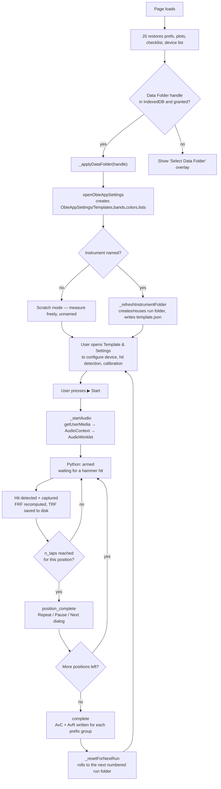
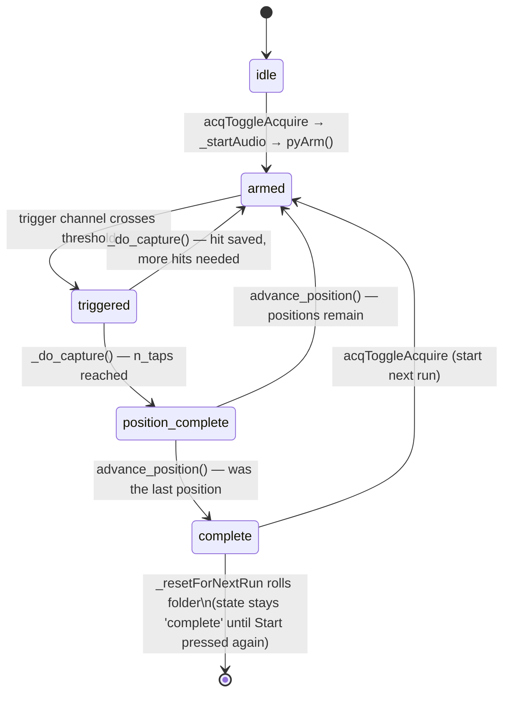
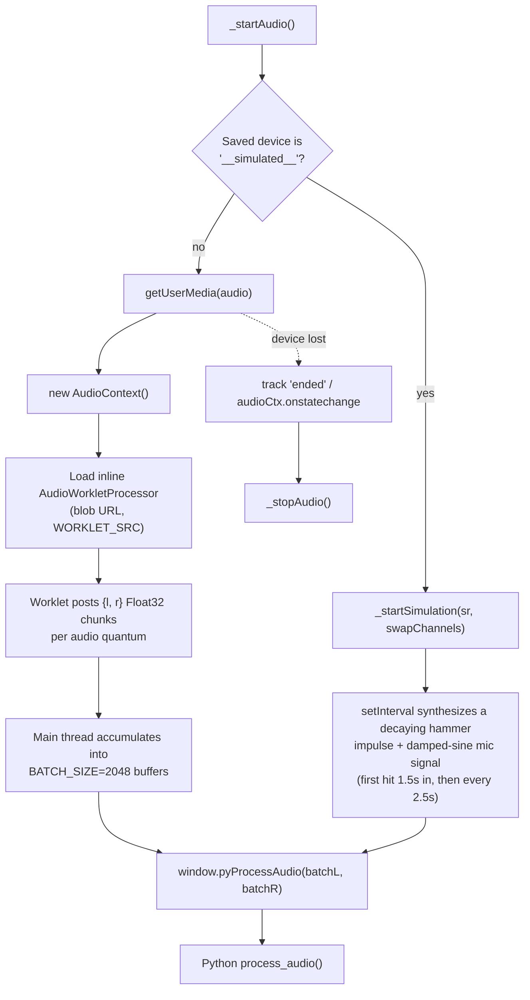
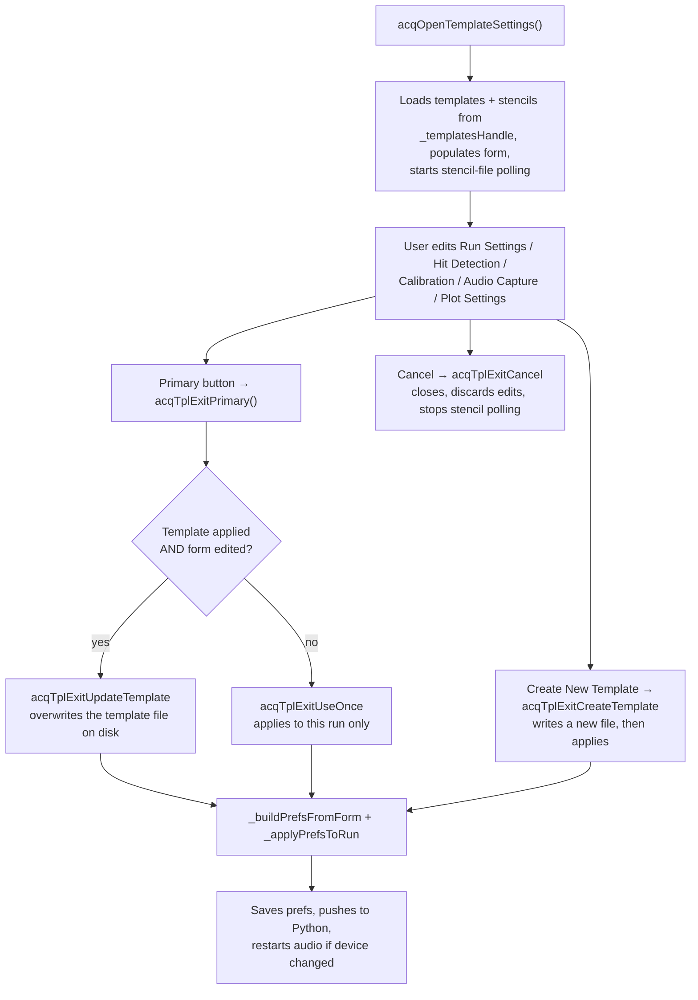
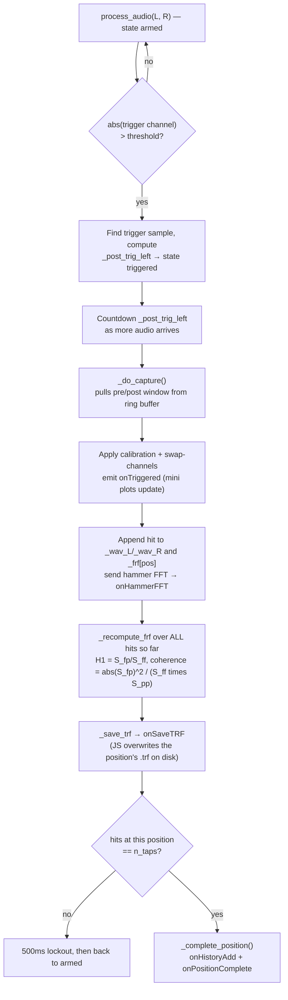
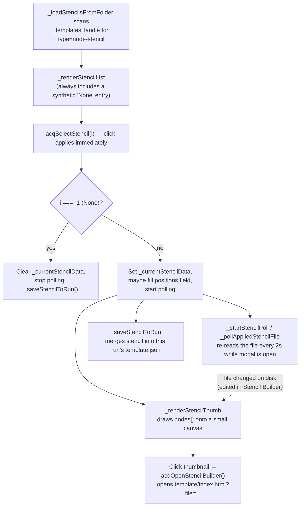

# Acquire — Code Flow

This documents how `acquire.js` (JS/UI, audio capture, file I/O) and `main.py`
(PyScript — hit detection, FRF math) work together. Diagrams render natively
on GitHub and in most Markdown/Mermaid-aware editors.

- JS owns: the UI, the Data Folder / File System Access API, audio capture
  (`getUserMedia` + `AudioWorklet`), and all Plotly rendering.
- Python (`main.py`, backed by `Python/processing/frf.py`) owns: the hit
  detection state machine, windowing/calibration, FRF (H1) + coherence math,
  and per-position averaging.
- The two sides talk through `window.py*` functions (JS → Python) and
  `window.on*` callbacks (Python → JS), wired up once when PyScript finishes
  loading (`onPyReady`).

## 1. Overview — one run, start to finish

## 2. The core state machine

`appState` (JS) mirrors Python's `_state` via `window.onStateChange`.

**Non-obvious guards worth knowing about:**
- `_post_capture_lockout` — 500 ms dead time after every capture so ringing/echo
  from the last hit can't immediately re-trigger.
- `_blockFRFUpdates` — set on a fresh run after `complete`, suppresses Python's
  FRF-history replay until the first genuine hit of the new run lands.
- Pausing capture nulls `audioCtx` **before** stopping tracks, because Chrome
  fires the track's `ended` event synchronously inside `.stop()` — the
  `ended`/`onstatechange` handlers both guard on `if (!audioCtx) return` to
  avoid double-handling their own shutdown.

## 3. Audio capture pipeline

## 4. Template & Settings modal — exit paths

## 5. Per-hit capture loop (Python side)

## 6. Node Stencil subsystem

## 7. Live plotting

| Trigger | What redraws |
|---|---|
| `onFRFUpdate`, `onTapFRF`, palette/opacity change, axis-range edit | `renderFRF()` — rebuilds the main FRF plot from `frfCache` (per-position averages) + `tapCache` (individual hits, if "Show History" is on) + coherence overlay |
| `window.onTriggered` (a real hit) | `_drawTrigPlots()` — Hammer + Mic time-domain mini plots, with threshold/cutoff lines |
| `window.onHammerFFT` | Hammer FFT mini plot, normalized to 0 dB peak |
| `window.onLivePlot` (continuous, non-triggered audio) | Intentionally a no-op — live audio doesn't redraw the mini plots, only real hits do |
| Clicking the FRF plot's camera icon | `_pngWhiteButton()` — temporarily swaps the transparent paper/plot background to white, downloads the PNG, restores the theme |

## 8. Other side systems

| System | Key functions | What it does |
|---|---|---|
| **LiveView** | `acqLiveView`, `_lvToggleCapture`, `_lvComputeH1`, `_lvFft*` | A separate mini audio pipeline (own worklet, own ring buffer, own H1/FFT math in JS) for previewing a device/threshold before committing to the real run. Can also pop out standalone via `acqOpenLiveViewStandalone`. On close, offers to sync its threshold/pre/post back into the real settings if they differ. |
| **Notes** | `acqNotes`, `acqSaveNotes`, `acqDeleteNotes`, `acqAddNotesPhotos` | Reads/writes `notes.txt` in the instrument folder, with a localStorage draft fallback; photos save to a `photos/` subfolder. |
| **Checklist** | `acqToggleChecklist`, `acqAgendaToggle`, `_restoreAgendaUI`, `_resetAgenda` | Per-item localStorage-persisted checkboxes; auto-resets on Start. |
| **Device picker** | `acqOpenDevicePicker`, `_enumerateDevicesInto`, `_updateSoundcardDisplay` | Lists real input devices plus a synthetic "⚡ Simulated Input"; shared by the modal's dropdown and the quick blue status-row picker. |
| **Undo / Clear / Start Over** | `acqDeleteLastHit`, `acqClearPosition`, `acqStartOver` | Pop the last hit (and delete its saved WAV), clear all hits at the current position, or wipe the entire run's `raw/`/`TRF/` contents and start a fresh run folder. |
