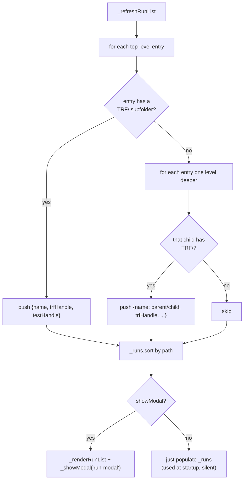
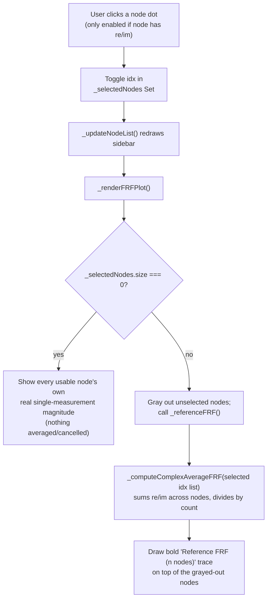
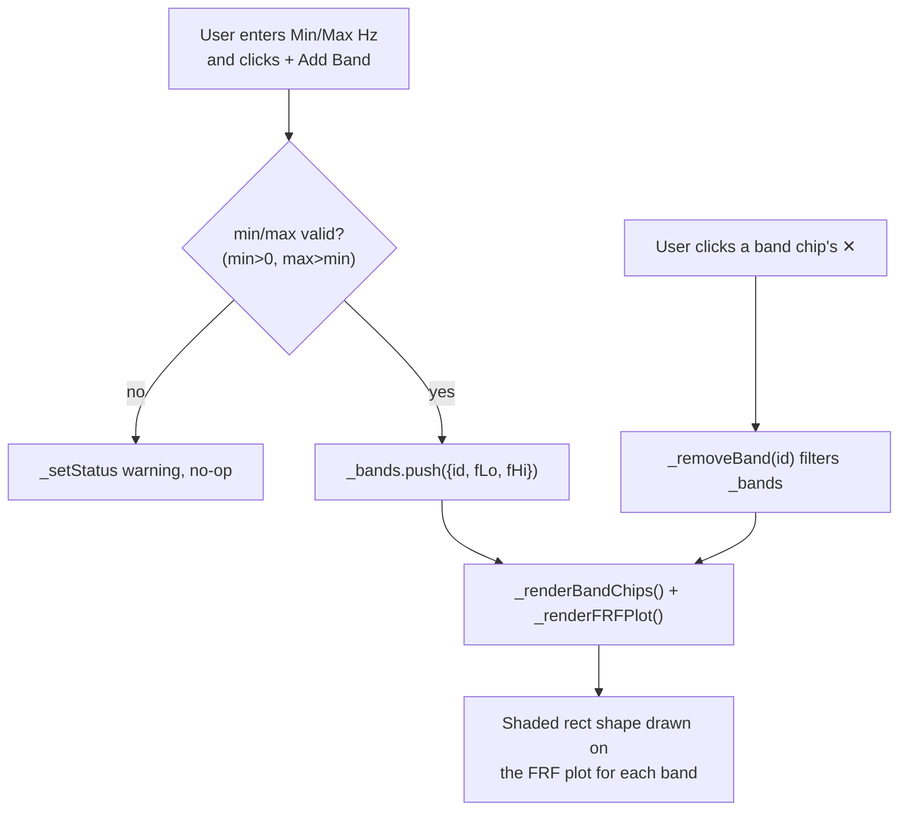
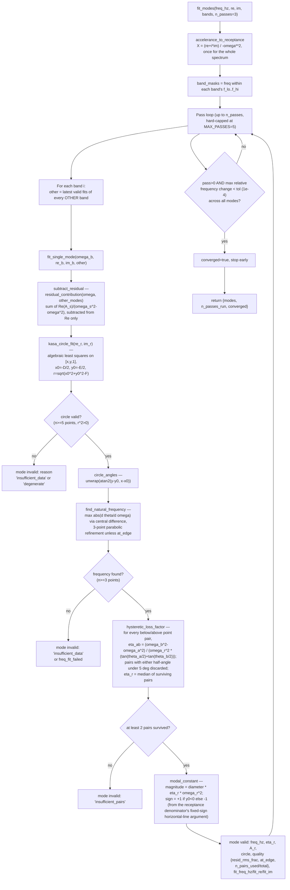
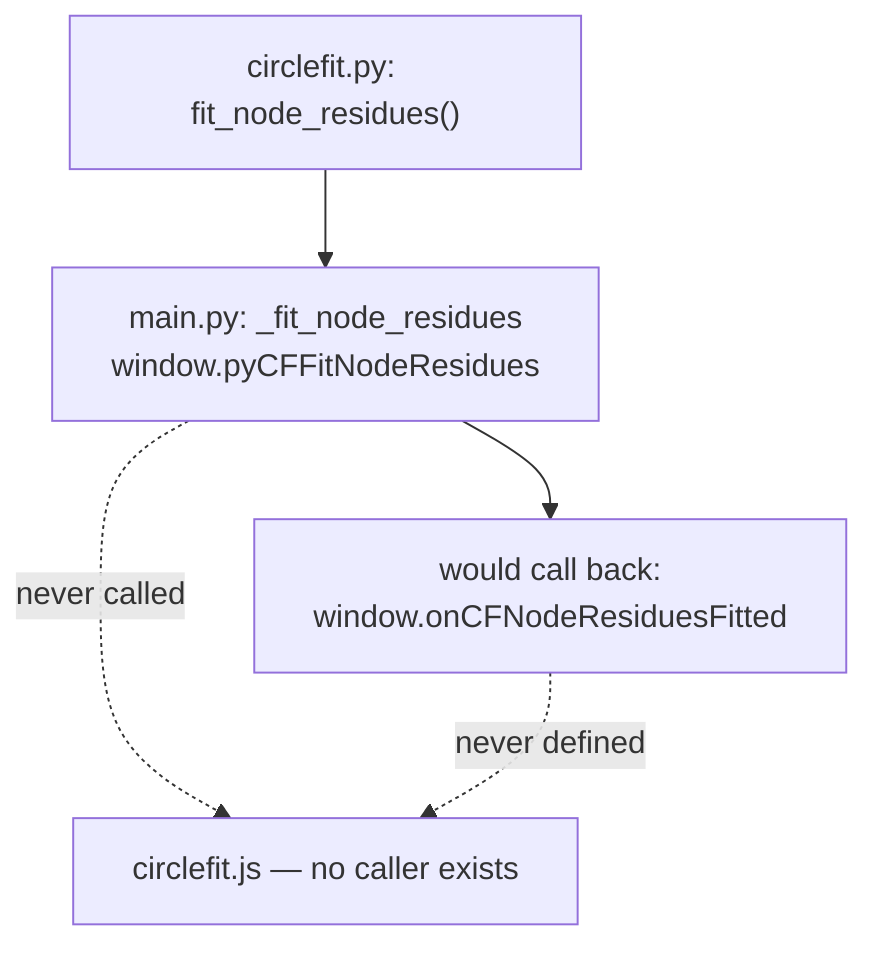

# Circle Fit — Code Flow

This documents how `circlefit.js` (JS/UI, TRF loading, Plotly rendering) and
`main.py` (PyScript — backed by `Web/py/circlefit.py`) work together to do
Kennedy–Pancu SDOF Nyquist circle fitting on hammer-impact FRF data.

- JS owns: the Data Folder / run picker (File System Access API), the node
  sidebar and complex-valued multi-node averaging, candidate-band management,
  and both Plotly plots (FRF magnitude + Nyquist).
- Python (`main.py`, backed by `Web/py/circlefit.py`, loaded locally per
  `pyscript.toml` alongside `trf_fileio.py`) owns all of the actual math:
  receptance conversion, the algebraic (Kåsa) circle fit, natural-frequency
  and hysteretic-damping extraction, modal-constant sign convention, residual
  (out-of-band mode) compensation, and the multi-pass global orchestrator.
- The two sides talk through `window.py*` functions (JS → Python) and
  `window.on*` callbacks (Python → JS), both wired up once at the bottom of
  `main.py` when PyScript finishes loading.
- Circle Fit has no live capture and no templates/settings modal of its own —
  it is a pure post-processing tool over TRF files already written by
  Acquire, and it hands its results off to Modal Analysis for 3D mode-shape
  viewing rather than rendering shapes itself.

## 1. Overview — Data Folder to a fitted mode

```mermaid
flowchart TD
    A["Page loads"] --> B{"Data Folder handle\nin IndexedDB and readwrite granted?"}
    B -- yes --> C["_applyDataFolder(handle)"]
    B -- no --> D["Toolbar shows empty folder name;\nuser must click Data Folder"]
    C --> E["openObieAppSettings\ncreates/reuses ObieAppSettings, Templates, etc."]
    E --> F["_refreshRunList(false)\nscans root for TRF/ subfolders,\ndoes not open the modal yet"]
    D --> G["cfSetDataFolder() —\nshowDirectoryPicker, saveDataFolderHandle"]
    G --> C
    F --> H["User clicks Load Run…"]
    H --> I["_refreshRunList(true) —\nrenders run-modal list"]
    I --> J["User clicks a run"]
    J --> K["_loadAllTRFs(run) —\nresets _frfData/_bands/_fittedModes,\nscans run.trfHandle for .trf/.trv"]
    K --> L["window.pyCFLoadTRF(pos, fname, bytes)\nper file"]
    L --> M["Python: parse_trf(raw) via trf_fileio\n-> onCFTRFLoaded(json)"]
    M --> N["_frfData[pos] = {freq, mag, re, im, coh?}"]
    N --> O{"all pending files done?"}
    O -- no --> L
    O -- yes --> P["_onAllLoaded —\nnode list, band chips, FRF plot,\nresults table all render"]
    P --> Q["User selects node(s) in sidebar\nand/or adds candidate bands"]
    Q --> R["User clicks Fit Modes"]
    R --> S["window.pyCFFitModes(freq, re, im, bandsJson, 3)"]
    S --> T["Python fit_modes() multi-pass fit\n-> onCFModesFitted(json)"]
    T --> U["Results table + Nyquist plot render"]
    U --> V["User clicks 'View in Modal Analysis'\nfor a fitted mode row"]
    V --> W["Opens ../modeshape/index.html\n?run=...&freq=..."]
```

## 2. Run discovery and TRF loading

`_refreshRunList` mirrors Modal Analysis's Load Run flow: it walks the root
Data Folder looking for any folder with a `TRF/` subfolder either directly
(single-instrument-per-folder layout) or one level down
(`instrument/run/TRF/`), and lists both shapes together, sorted by path.

Inside `_loadAllTRFs`, filenames are matched with `/_(\d+)\.[^.]+$/` to pull
a 1-based node/position index out of the trailing `_NN.trf` suffix (stored
0-based as `pos = parseInt(m[1]) - 1`). Files that don't match this pattern
are silently skipped. `main.py`'s `_load_trf` calls the shared
`trf_fileio.parse_trf`, forwarding `re`/`im` only if the TRF actually carries
complex data (`fComplex` 1.0 or 2.0) and `coh` only if coherence was saved —
nodes without complex data still load (for the magnitude-only per-node FRF
view) but are marked "no cplx" and excluded from circle fitting.

## 3. Node sidebar and the complex-valued reference FRF

Circle fitting needs phase, so the reference curve fed to `fit_modes` is a
genuinely new complex average — `_computeComplexAverageFRF` — distinct from
Modal Analysis's magnitude-only averaging (which discards phase and can't be
used here).

`_referenceFRF()` deliberately returns `null` when nothing is selected rather
than silently defaulting to an average of every node — averaging arbitrary
nodes' complex FRFs can partially cancel where they're out of phase (normal
for real mode shapes), so which nodes feed the fit must be an explicit user
choice, per the comment above `_referenceFRF` in `circlefit.js`.

## 4. Candidate bands

## 5. Fit Modes — the actual circle-fit pipeline

`cfFitModes()` requires at least one band and at least one selected node
(so a reference FRF exists), then calls
`window.pyCFFitModes(ref.freq, ref.re, ref.im, JSON.stringify(bandsPayload), 3)`
— always 3 passes from the UI today, though `fit_modes` itself accepts
`n_passes` up to `MAX_PASSES = 5`.

`fit_single_mode` keeps the residual-subtracted `(omega, re, im)` it actually
fit (`fit_freq_hz`/`fit_re`/`fit_im`) specifically so the Nyquist plot can
show the same points the circle was fit to — not the raw band data, which
would visually mismatch the circle whenever residual compensation from
another mode is active.

On the JS side, `onCFModesFitted` reshapes each mode's `A_r` from
`{re, im}` into `{real, imag}`, picks the first valid row as
`_selectedModeRow`, and re-renders both the results table and the Nyquist
plot.

## 6. Plotting — what triggers redraws

| Trigger | What redraws |
|---|---|
| TRF load finishing (`_onAllLoaded`) | `_renderFRFPlot()` — every usable node's own magnitude trace (log-x, dB), `_renderResultsTable()` reset to empty, `Plotly.purge('cf-nyquist-plot')` |
| Clicking a node dot | `_updateNodeList()` + `_renderFRFPlot()` — switches between per-node traces and grayed-nodes-plus-bold-reference view |
| Add Band / remove a band chip | `_renderBandChips()` + `_renderFRFPlot()` — adds/removes a shaded `rect` shape over the band's frequency span |
| `onCFModesFitted` (fit finishes) | `_renderResultsTable()` + `_renderNyquistPlot()` |
| Clicking a results-table row | `_selectedModeRow` changes → `_renderResultsTable()` (highlight) + `_renderNyquistPlot()` (switches which mode's circle is shown) |
| Nyquist plot content | Built only from the currently selected mode's `fit_re`/`fit_im` (residual-subtracted data points), the fitted circle traced as 128 points around `(x0,y0,r)`, and a star marker at the point nearest `mode.freq_hz` in `fit_freq_hz` |

Both plots use `Plotly.react` with `PCFG_HOVER` (`displayModeBar: 'hover'`);
neither plot has axis-range persistence, templates, or a white-background PNG
export button — unlike Acquire/Explore, Circle Fit has no preferences modal
at all.

## 7. Per-node residue extraction — exposed but not wired into the UI

`Web/py/circlefit.py`'s `fit_node_residues(freq_hz, re, im, modes)` and its
`main.py` wrapper `_fit_node_residues` (registered as
`window.pyCFFitNodeResidues`, calling back through
`js.window.onCFNodeResiduesFitted`) implement a per-node linear
least-squares solve for each node's own complex residue once a mode's
`omega_r`/`eta_r` are fixed — see `math.html` §7.7. This would let Modal
Analysis eventually show damping-corrected, per-mode residue mode shapes
instead of raw interpolated FRF magnitude.

**Neither `window.pyCFFitNodeResidues` nor `window.onCFNodeResiduesFitted`
is referenced anywhere in `circlefit.js` or `index.html`** (confirmed by
grep) — the function is fully implemented and exposed to the browser, but
nothing in Circle Fit's UI calls it yet. It is available for a future
feature, exactly as `math.html`'s callout states.

## 8. Other side systems

| System | Key functions | What it does |
|---|---|---|
| **Data Folder** | `cfSetDataFolder`, `_applyDataFolder` | Standard shared-handle pattern via `saveDataFolderHandle`/`loadDataFolderHandle` and `openObieAppSettings`; same "new Data Folder" alert convention as other tools, including a note if seed downloads failed. |
| **Handoff to Modal Analysis** | `_viewInModalAnalysis` | Opens `../modeshape/index.html?run=<path>&freq=<rounded Hz>` in a new tab for the selected fitted mode's row — Circle Fit itself never renders a 3D mode shape. |
| **Status line** | `_setStatus` | Single `` textual status; no timed `.save-msg` (no save actions exist in this tool — nothing else to time out at 2500 ms). |
| **Help** | `cfHelp` | Opens `../../Docs/index.html` in a new tab, per the standard Help-button convention. |
