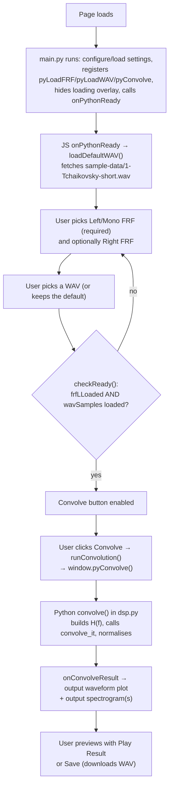
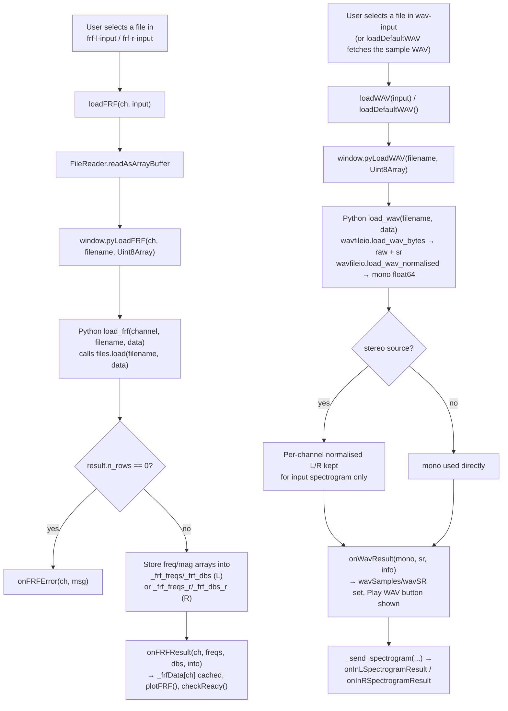
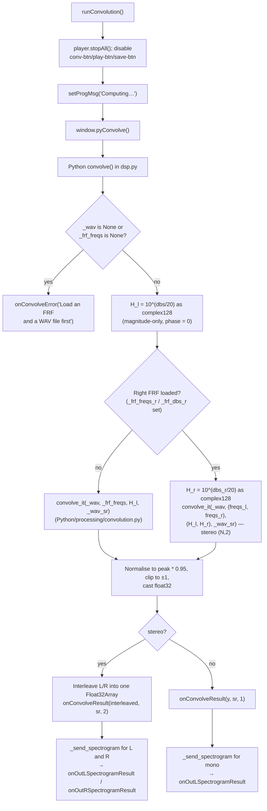
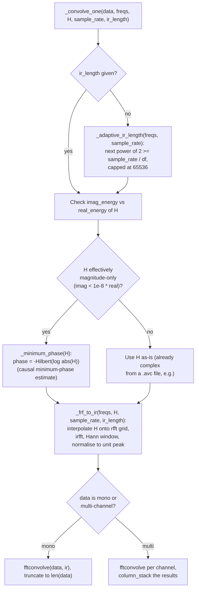

# Convolve — Code Flow

This documents how `convolve.js` (JS/UI, file pickers, Plotly rendering,
playback) and `main.py` / `dsp.py` (PyScript — WAV/FRF parsing, spectrograms,
convolution math) work together.

- JS owns: individual file pickers for the FRF(s) and WAV (no Data Folder —
  Convolve uses the Convolve/Explore-style single-file-picker pattern), the
  four-plot Plotly grid, `AudioPlayer` playback of the input/output buffers,
  WAV export via `encodeWAV`, and output-device selection.
- Python (`main.py` boots the module, `dsp.py` does the work) owns: parsing
  FRF files via `files.py` (`load`), decoding WAV bytes via `wavfileio.py`
  (`load_wav_bytes` / `load_wav_normalised`), building spectrograms via
  `spectrogram.py` (`compute_spectrogram`), and the actual convolution via
  `Python/processing/convolution.py`'s `convolve_it`.
- The two sides talk through `window.py*` functions (JS → Python, registered
  as `create_proxy`-wrapped callables in `main.py`) and `window.on*` callbacks
  (Python → JS). There is no shared state machine like Acquire's — Convolve is
  a straight-line pipeline: load FRF(s) + WAV → convolve → preview/export.

## 1. Overview — one pass, start to finish

## 2. Loading the FRF and WAV (individual file pickers)

Per project convention, Convolve has **no Data Folder button** — each input
is picked one file at a time via plain `<input type="file">` elements
(`frf-l-input`, `frf-r-input`, `wav-input` in `index.html`).

Accepted FRF extensions: `.trf .trv .avc .avr .csv` (routed through
`files.py`'s format-sniffing `load()`, same contract as Explore). Accepted
WAV: `.wav`/`audio/*`.

## 3. The convolution itself (JS → Python → convolution.py → JS)

**Inside `convolve_it` (`Python/processing/convolution.py`), per FRF:**

Convolve always calls `convolve_it` directly with pre-loaded arrays (the
"Web version" path noted in the module docstring) — it never calls the
higher-level `convolve_with_frf(wav_path, frf_paths)`, which is the
file-path-based entry point meant for desktop use.

## 4. Playback and WAV export

```mermaid
flowchart TD
    A["Play WAV button\n(togglePlayWAV)"] --> B["player.toggle('wav', wavSamples, wavSR)"]
    C["Play Result button\n(togglePlay)"] --> D["player.toggle('out', outSamples,\noutSR, outChannels)"]
    B --> E["AudioPlayer (audio.js):\ncreates AudioContext buffer,\nroutes to selected sink, plays/stops"]
    D --> E
    F["Save button (saveWAV)"] --> G["encodeWAV(outSamples, outSR, outChannels)\n16-bit PCM, mono or interleaved stereo"]
    G --> H["Blob → object URL → auto-click\na hidden <a download> →\nconvolved_<timestamp>.wav"]
    I["Output device <select>"] --> J["enumerateOutputDevices() lists\nnavigator.mediaDevices audiooutput devices"]
    J --> K["player.setSinkId(deviceId) on change\n+ persisted via Python _save_settings\n(config.py → obieWebApp_convolveIt)"]
```

`AudioPlayer` (shared `js/audio.js`) is a two-track exclusive player keyed by
`'wav'` and `'out'` — starting one stops the other via `stopAll()`, and each
track's button label/state (▶ Play / ■ Stop) is kept in sync automatically.

## 5. Plotting — what triggers each redraw

| Trigger | What redraws |
|---|---|
| `onFRFResult` (either channel loaded/reloaded) | `plotFRF()` — rebuilds the FRF magnitude plot from `_frfData.l` / `_frfData.r`, auto-scaling the y-axis to the loaded traces; shows a legend only when both channels are present |
| `onWavResult` | Enables the Play WAV button and `checkReady()`; the input plot itself is filled by the spectrogram callback, not directly here |
| `onInLSpectrogramResult` / `onInRSpectrogramResult` | Input is always mono in practice (`onInRSpectrogramResult` is a no-op); `onInLSpectrogramResult` caches the STFT result and calls `_renderTopSpec()` to draw the `wav-plot` heatmap |
| `onConvolveResult` | `plotWaveform('out-plot', outSamples, outSR, ...)` — decimated line plot (max ~5000 points via a stride) of the convolved output; also populates `out-info` (duration/rate/samples/mono-or-stereo) |
| `onOutLSpectrogramResult` | Caches `_outLSpecCache`, resets `_outRSpecCache`/`_botShowL=true`, calls `_renderBotSpec()` to draw `spec-plot`; hides the L/R toggle button until a right-channel spectrogram also arrives |
| `onOutRSpectrogramResult` | Caches `_outRSpecCache`, reveals the `out-spec-btn` toggle; redraws `spec-plot` only if the toggle currently shows R |
| `ciToggleBotSpec()` (Show R / Show L button) | Flips `_botShowL` and calls `_renderBotSpec()` to swap between the cached L/R output spectrograms |
| `ciToggleSpecScale()` (Freq: Lin/Log button) | Flips `_specLogFreq` and redraws both `_renderTopSpec()` and `_renderBotSpec()` with the y-axis type toggled between `'linear'` and `'log'` |
| Sidebar drag resize (`_initResizer`) | Calls `Plotly.Plots.resize()` on all four plot divs (`frf-plot`, `wav-plot`, `out-plot`, `spec-plot`) as the sidebar width changes |

Spectrogram data arrives from Python as flat arrays (`_unpackSpec` reshapes
`flatZ` into an `nFreqs × nTimes` 2-D array for Plotly's `heatmap` `z`), all
computed by the single canonical `compute_spectrogram(sig, sr)` in
`Python/processing/spectrogram.py` — the same function backs the input,
output-L, and output-R spectrograms alike, just called with different signals.

## 6. Other side systems

| System | Key functions | What it does |
|---|---|---|
| **Settings persistence** | `main.py`'s `_save_settings`, `config.py` (`configure`/`load`/`save`) | Persists only the selected output device id under the `obieWebApp_convolveIt` config namespace; restored into `window.ciSavedOutputDeviceId` on load and applied via `player.setSinkId` once devices are enumerated |
| **Readiness gating** | `checkReady()` | Enables the Convolve button only once `frfLLoaded` is true and `wavSamples !== null`; the Right FRF is always optional |
| **Error/progress messaging** | `setSt(id, txt, cls)`, `setProgMsg`/`clearProgMsg` | Per-field status text (`file-status`, colored `ok`/`err`) for FRF/WAV loads, and a transient `prog-msg` line during convolution ("Building impulse response…", "Convolving…", or an error that self-clears after ~4-6 s) |
| **Help / Tips** | `ciHelp()`, `ciTips()` | Open `../../Docs/index.html` and `../../Docs/shortcuts.html` in a new tab |
