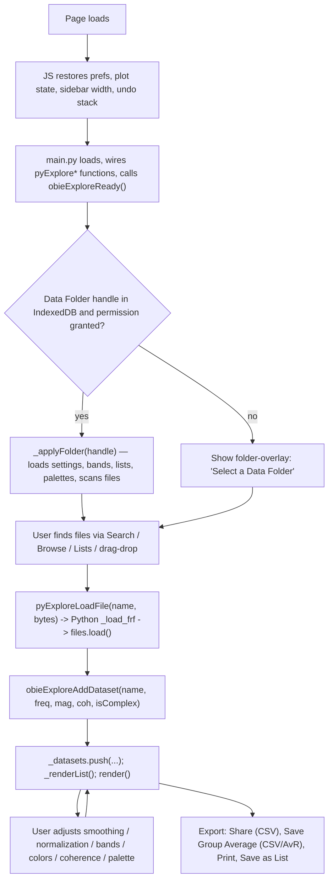
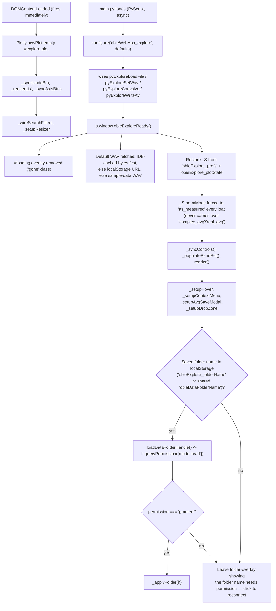
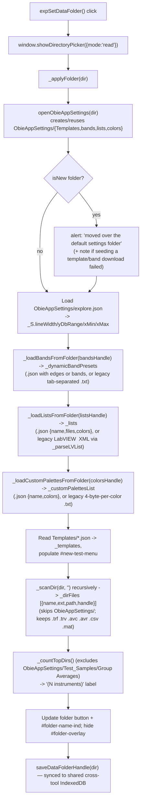
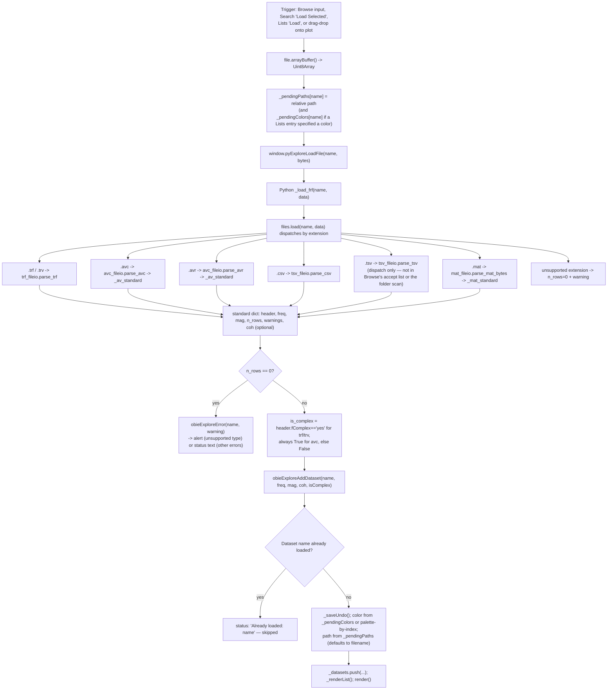
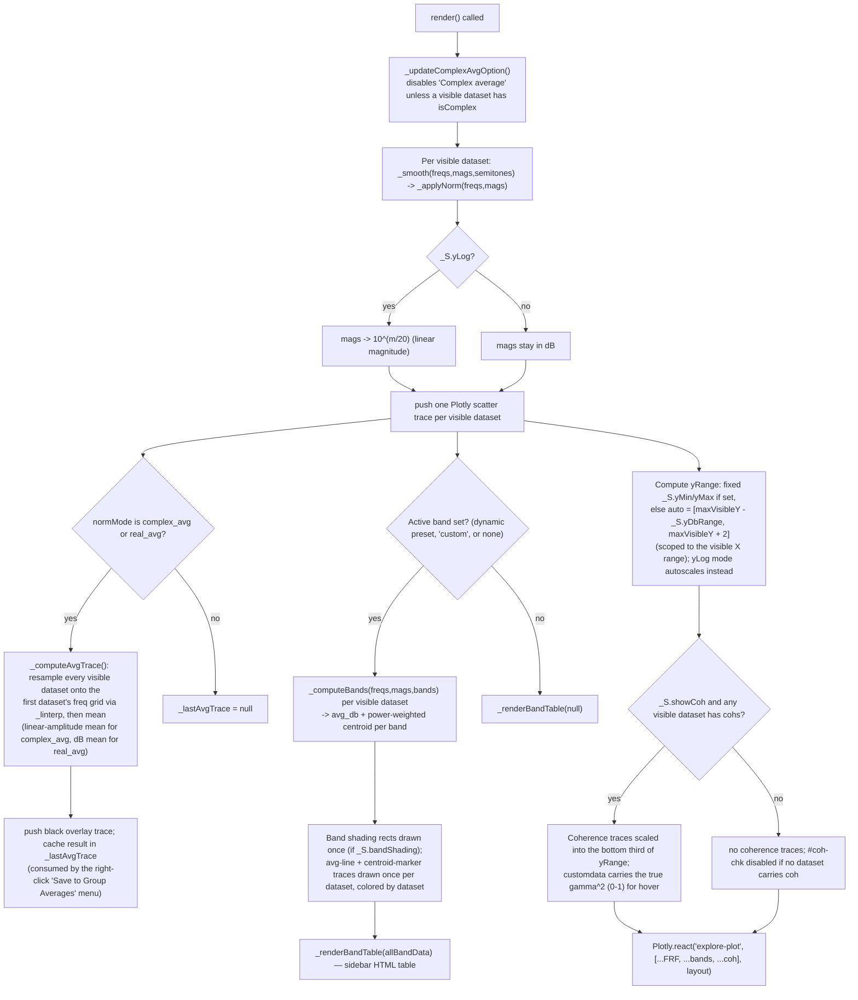
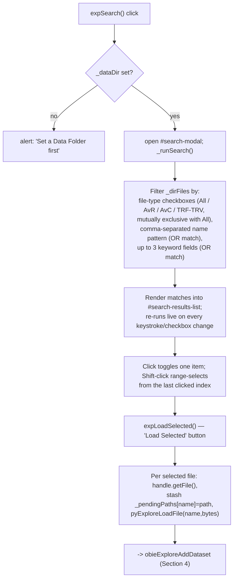
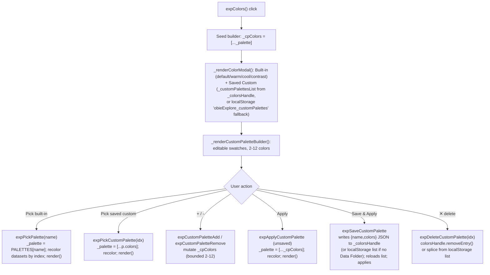
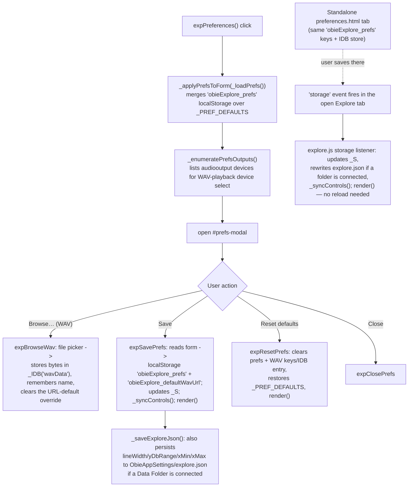

# Explore — Code Flow

This documents how `explore.js` (JS/UI, Data Folder access, Plotly rendering,
and — notably — all of the FRF math) and `main.py` (PyScript, backed by
`Web/py/files.py` and the canonical `Python/fileio/`/`Python/processing/`
modules) work together. Diagrams render natively on GitHub and in most
Markdown/Mermaid-aware editors.

- JS (`explore.js`) owns: the UI, the Data Folder / File System Access API,
  search/lists/color-palette/preferences state, and — unlike Acquire — the
  actual FRF math shown on screen: smoothing (`_smooth`), normalization
  (`_applyNorm`/`_norm`/`_normByAvg`), group averaging (`_computeAvgTrace`),
  and band averaging (`_computeBands`) are all plain JS, run fresh inside
  `render()` on every redraw.
- Python (`main.py`) owns a narrower slice: dispatching file bytes to the
  canonical parsers in `Web/py/files.py` → `Python/fileio/*` (trf/avc/avr/
  tsv/csv/mat), decoding/caching the default WAV, running the convolution
  preview (`Python/processing/convolution.py`), and building `.avr` bytes
  for the "Group Average → Save as AvR" export (`Python/fileio/avc_fileio.py`
  → `build_avr`).
- The two sides talk through `window.py*` functions (JS → Python, wired at
  the bottom of `main.py`) and `window.on*`/`window.obieExplore*` callbacks
  (Python → JS).

## 1. Overview — one session, start to finish

## 2. Page load / init sequence

`DOMContentLoaded` (JS) and PyScript's `main.py` load independently and
converge once `obieExploreReady()` fires.

## 3. Data Folder — pick, scan, and settings sync

## 4. File loading & parsing dispatch

## 5. Plotting pipeline — `render()`

`render()` is the single redraw entry point — called after any dataset,
axis, smoothing, normalization, band, palette, or coherence-toggle change.

## 6. Search modal — find and load files from the Data Folder

## 7. Lists and Group Average — saved file sets and average export

| Action | Function(s) | What happens |
|---|---|---|
| Open Lists modal | `expLists` | Renders `_lists` (populated by `_loadListsFromFolder` from `ObieAppSettings/lists/`: JSON `{name,description,files,colors}`, or legacy LabVIEW `<Array><Cluster>` XML parsed by `_parseLVList`) |
| Load a list | `expLoadList(idx)` | Per file path: match `_dirFiles` by exact path, else by basename; skip names already loaded; `pyExploreLoadFile` per match; reports "N loaded, M not found" |
| Save current datasets as a list | `expSaveCurrentList` | Prompts for name/description, writes `{name,description,files:[d.path or d.name,...]}` as JSON under `_listsHandle`, then reloads `_lists` |
| Save Group Average — CSV | `expSaveGroupAverage` -> `format:'csv'` | Requires `_lastAvgTrace` (only set while `normMode` is `complex_avg`/`real_avg`); requests readwrite permission on `_dataDir`, writes `Frequency_Hz,<mode>_Average_dB` rows into `Group Averages/<name>.csv` |
| Save Group Average — AvR | `expSaveGroupAverage` -> `format:'avr'` | `_buildAvFile()` calls `pyExploreWriteAv` -> Python `_write_av_file` -> `avc_fileio.build_avr(freqs, linear_mags, n_averages, AT_MEAN)`; bytes come back via `onExploreAvReady` and are written into `Group Averages/<name>.avr` |
| Right-click "Save to Group Averages…" | `_setupContextMenu` | Only shown on the plot when `normMode` is `complex_avg`/`real_avg` **and** `_lastAvgTrace` exists |

## 8. Color palette subsystem

## 9. Preferences — in-page modal + standalone tab

Note: `preferences.html` duplicates the WAV/plot-defaults form and its own
minimal IndexedDB helper so it can run outside the main tool page, but reads
and writes the exact same `localStorage` keys (`obieExplore_prefs`,
`obieExplore_wavName`, `obieExplore_defaultWavUrl`) and the same `obieExplore`
IDB database/`wavData` key as `explore.js`.

## 10. Other side systems

| System | Key functions | What it does |
|---|---|---|
| **Interpret modal** | `expInterpret`, `expInterpretSetDict`, `_renderInterpretDict`, `expSetHarmonicNote` | Redraws visible datasets on a separate `interpret-plot` with shaded region overlays from `INTERPRET_DICTS` (Radiation / Accelerance / Vibrometer presets: A0, CBR, B1-, B1+, Transition Hill, Bridge Hill, Upper Hill) plus optional dotted note-harmonic lines from `HARMONIC_NOTES` (12 semitones, G3–F#4 fundamentals) |
| **Convolve & Play** | `_playDataset`, `pyExploreConvolve` / `_convolve_explore`, `onExploreConvolveResult` | Per-dataset ▶ button converts the dataset's dB magnitudes to `H = 10^(mag/20)` (amplitude only, no phase), calls Python `convolve_it()` (`Python/processing/convolution.py`) against the cached default WAV, and plays the result through a fresh `AudioContext` |
| **Default WAV** | `pyExploreSetWav` / `_set_default_wav`, `obieExploreWavReady` / `obieExploreWavError` | Decodes a WAV via `scipy.io.wavfile` from IDB-cached bytes or a fetched URL, mono-mixes and peak-normalizes it; used only as the Convolve & Play source |
| **Instrument notes panel** | `_showInstrumentNotes`, `_notesInstrumentCache` | On dataset-row hover, looks up `<instrument>/notes.txt` (first path segment under the Data Folder root — written by Acquire's Notes feature) and shows it read-only in the sidebar; caches per instrument, including confirmed-absent |
| **Coherence overlay & hover readout** | `render()` coherence block, `_setupHover`, `_freqToNote` | `#coh-chk` is enabled only when a loaded dataset carries `d.cohs`; hovering shows `γ² = …` for coherence traces or `Amp = … dB` + nearest musical note for FRF traces |
| **Print** | `expPrintPlot` | `Plotly.toImage()` snapshot opens in a separate blank tab with an editable title/notes area and a Print button — kept isolated from the toolbar/sidebar |
| **Share (CSV export)** | `expShare` | Exports all visible datasets to one CSV over the union of their exact frequency points (no interpolation — a point missing at a given frequency is left blank) |
| **Keyboard shortcuts** | `document` keydown handler | ArrowUp/Down: line width ±0.25px; ArrowLeft/Right: FRF trace opacity ±0.05 (ignored while an input/select/textarea has focus) |
| **Undo** | `_saveUndo`, `expUndo`, `_syncUndoBtn` | Snapshots up to 20 deep-copied `_datasets` states before every destructive op (See All/None, Reduce, Clear All, loading a new dataset) |
| **Sidebar resizer** | `_setupResizer` | Drag-resizable sidebar (80–500px), width persisted to `localStorage['obieExplore_sidebarW']` |
