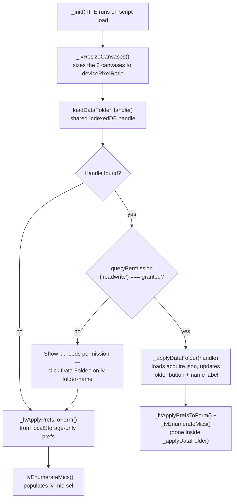
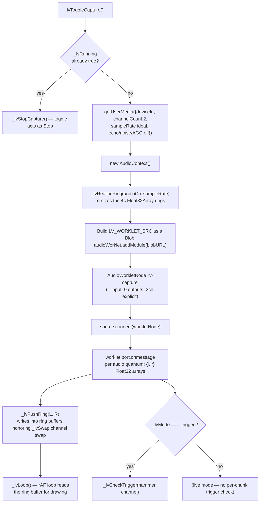
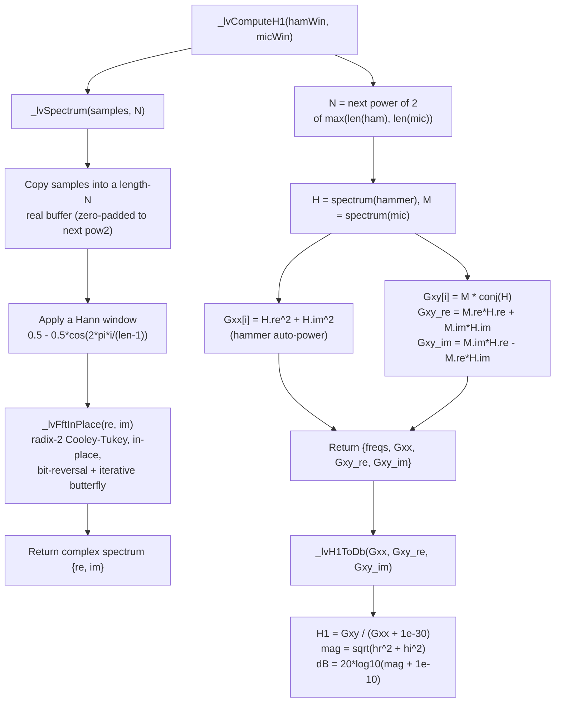
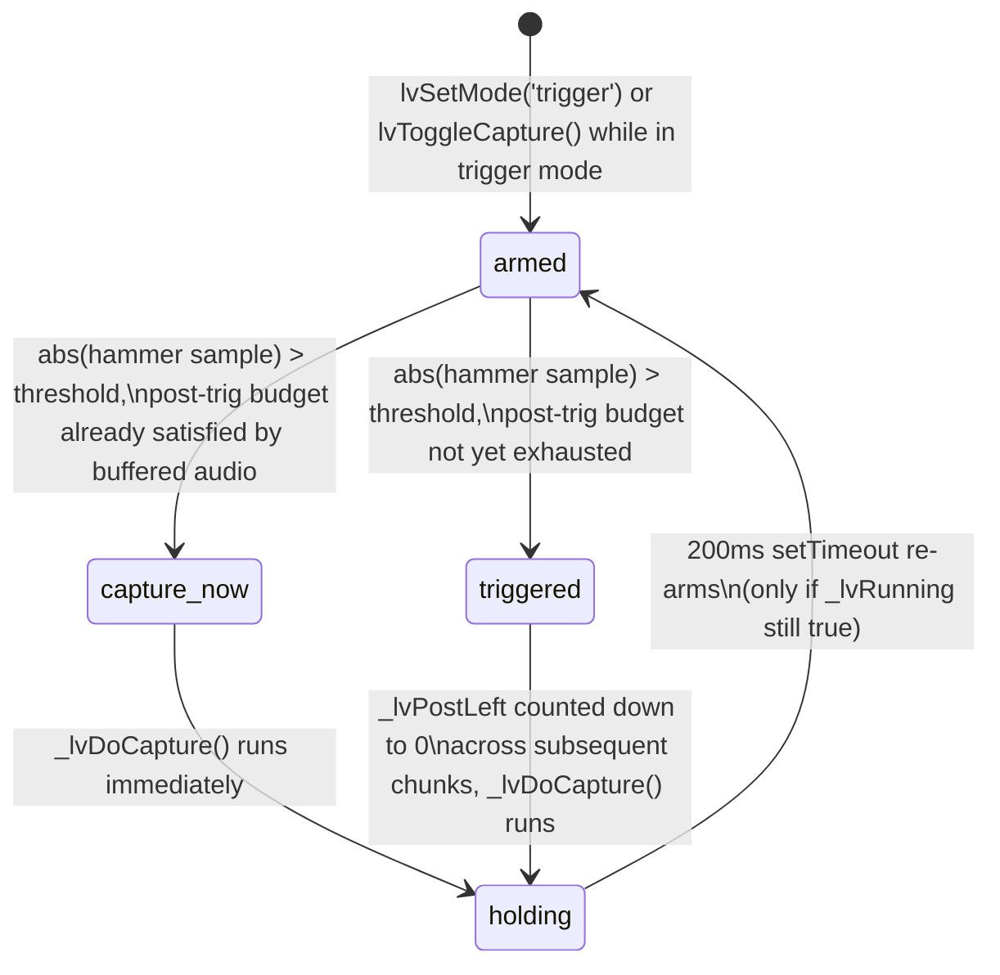
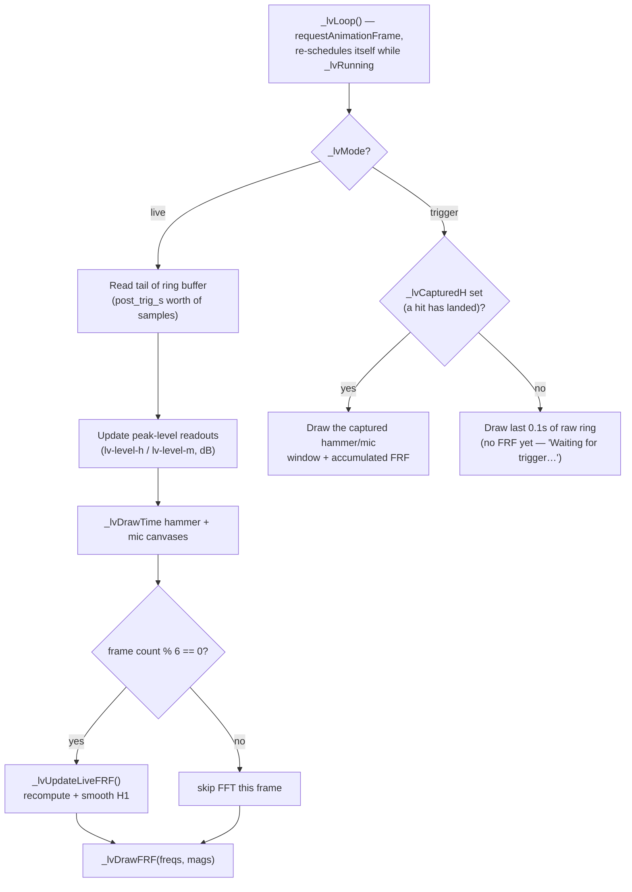

# LiveView — Code Flow

LiveView is **pure JS — there is no `main.py` and no `pyscript.toml` in this
folder, and that's deliberate**. Per the header comment in `liveview.js`, this
tool does no FRF/TRF file I/O and no canonical DSP that belongs in `Python/`
(per CLAUDE.md Rule 1) — it's a throwaway live preview, not a data-producing
tool, so it follows the same precedent as `tools/template/` (Stencil Builder)
rather than the Explore/Acquire/Convolve PyScript pattern. Every number you
see on screen — FFT, H1, canvas rendering — is computed and drawn by
`liveview.js` alone, in the main thread and one small inline `AudioWorklet`.

This is a relocated/standalone copy of the "LiveView dialog" embedded in
Acquire (`acquire.js`) — that near-duplicate is not documented here; this file
covers only the standalone `tools/liveview/` version.

- JS owns everything: the UI, the Data Folder handle (read-only use — just to
  find `ObieAppSettings/acquire.json`), `getUserMedia` + `AudioWorklet` audio
  capture, a hand-rolled FFT/H1, and raw `<canvas>` 2D rendering (no Plotly on
  this page at all).
- Settings (threshold / pre-trig / post-trig / device) are layered: disk
  values from `ObieAppSettings/acquire.json` (`_diskPrefs`) are the base,
  overridden by whatever's in this browser's `obieAcquire_prefs` localStorage
  (`_loadPrefs()`). This tool never talks to a running Acquire tab directly —
  "Save as Default Settings" writes back to `acquire.json` on disk, which a
  live Acquire session only picks up on its own next load / reset-to-defaults.

## 1. Page load / init sequence

**Notes:**
- `_applyDataFolder` is also invoked directly by `lvSetDataFolder()` (the
  toolbar 📁 button) — both paths converge on the same function, which reads
  `acquire.json` via `_settingsHandle`, falls back to `{}` on any read error,
  and always ends by calling `_lvApplyPrefsToForm()` + `_lvEnumerateMics()`.
- The tool is fully usable with no Data Folder at all: the mic list still
  populates and the threshold/pre/post fields still default from `_loadPrefs()`
  (`threshold ?? 0.05`, `pre_trig_s ?? 0.01`, `post_trig_s ?? 0.30`).

## 2. Audio capture pipeline

The `AudioWorkletProcessor` itself (`LVCaptureProcessor`, registered as
`lv-capture`) is minimal: it just slices the raw input channels and posts
`{l, r}` to the main thread every render quantum — all buffering, windowing,
and math happens on the main thread against `_lvRingH` / `_lvRingM`.

**Ring buffer details:**
- `LV_RING_SECS = 4` seconds, two parallel `Float32Array`s (`_lvRingH` =
  hammer channel, `_lvRingM` = mic channel), sized to `4 * sampleRate` and
  reallocated in `_lvReallocRing` whenever capture (re)starts.
- `_lvPushRing` writes one sample at a time at write cursor `_lvRingWr`,
  wrapping mod `_lvRingSz`; `_lvSwap` (from `prefs.swap_channels`) decides
  whether raw `L`/`R` map to hammer/mic or vice versa.
- `_lvRingTail(n)` reads the most recent `n` samples (used by live mode).
- `_lvRingWindowAt(center, pre, post)` reads a `pre+post`-sample window
  centered on a recorded ring position (used by trigger-mode capture).
- `lvRestartWithDevice()` — called when the device `<select>` changes while
  running — stops capture, waits 120 ms for the old `AudioContext` to close,
  then calls `lvToggleCapture()` again to restart on the new device.

## 3. Live FFT / H1 math (all in JS)

- `_lvFftInPlace` is a self-contained iterative radix-2 FFT (bit-reversal
  permutation, then log2(N) butterfly passes) — no external FFT library.
- H1 = mic-over-hammer cross-spectrum over hammer auto-spectrum, the same
  H1 estimator family as Acquire/`Python/processing/frf.py`, but computed
  independently in JS with no coherence term and no calibration/window
  compensation — this is a rough preview, not the canonical FRF.
- Two accumulation paths use this same pair of functions:
  - **Live mode** (`_lvUpdateLiveFRF`): computes H1 fresh off the last
    `post_trig_s` seconds of the ring buffer every 6th animation frame, then
    exponentially smooths it into `_lvLiveFRF.mags` with weight
    `a = 1 / numAvg` (the "Averages" field), i.e. `mags = mags*(1-a) + new*a`.
  - **Trigger mode** (`_lvDoCapture`): sums `Gxx`/`Gxy_re`/`Gxy_im` across
    every captured hit into running totals (`_lvFrfGxx`, `_lvFrfGxy_re`,
    `_lvFrfGxy_im`, counted by `_lvFrfCount`) — a true multi-hit average, not
    exponential smoothing, converted to dB fresh each time via
    `_lvH1ToDb`.

## 4. Trigger-mode hit detection state machine

`_lvCheckTrigger(hammerBatch)` runs once per incoming worklet chunk while in
trigger mode:
- **armed**: scans the chunk sample-by-sample for `abs(sample) > threshold`;
  on a hit, records the ring position of the trigger sample
  (`_lvTrigRingPos`) and computes `_lvPostLeft` (remaining post-trig samples
  needed) — if the chunk already contains enough post-trig audio,
  transitions straight to `capture_now` and fires `_lvDoCapture()`
  synchronously; otherwise moves to `triggered` and waits.
- **triggered**: decrements `_lvPostLeft` by each new chunk's length; once
  `<= 0`, fires `_lvDoCapture()`.
- `_lvDoCapture()` sets state to `holding`, pulls the pre/post window from the
  ring via `_lvRingWindowAt`, runs `_lvComputeH1`, accumulates it into the
  running FRF sum, updates the `lv-hits` counter, and after 200 ms flips back
  to `armed` (only if capture is still running).

Switching modes via `lvSetMode(m)` (Live/Trigger toggle buttons) always resets
all FRF accumulators and captured buffers (`_lvFrfGxx`/`_lvCapturedH`/etc. all
nulled, `_lvFrfCount = 0`), and re-arms trigger state if entering trigger
mode.

## 5. Rendering — canvas draw loop

- All three canvases (`lv-hammer-canvas`, `lv-mic-canvas`, `lv-frf-canvas`)
  are drawn with plain Canvas 2D — `_lvDrawTime` for the two time-domain
  scopes (draws a center line, optional dashed threshold lines at
  ±threshold, the waveform decimated to one sample per pixel column, and a
  peak-voltage readout), `_lvDrawFRF` for the FRF view (log-frequency x-axis
  100–12000 Hz with gridlines at standard third-octave-ish marks, auto-ranged
  y-axis clamped to a 60 dB window above the peak).
- `_lvResizeCanvases()` re-runs on `window.resize` to keep canvas backing
  size matched to CSS size × `devicePixelRatio`.
- There is no explicit "Pause" button — `lvToggleCapture()` (▶ Start / ■
  Stop) is the only run/stop control, and `_lvStopCapture()` tears down the
  entire audio graph (worklet, source, stream tracks, `AudioContext.close()`)
  and cancels the animation frame. `lv-clear-btn` ("Clear FRF", trigger-mode
  only) calls `lvClearFRF()` to zero the accumulators without stopping
  capture.

## 6. Other side systems

| System | Key functions | What it does |
|---|---|---|
| **Data Folder** | `lvSetDataFolder`, `_applyDataFolder` | Picks a folder via `window.showDirectoryPicker`, calls shared `openObieAppSettings`/`saveDataFolderHandle` (same IndexedDB handle used by Explore/Acquire/Convolve), then reads `ObieAppSettings/acquire.json` into `_diskPrefs`. |
| **Save as Default Settings** | `lvSaveAsDefaultSettings` | Reads the current threshold/pre-trig/post-trig/device fields from the form, merges into `_diskPrefs`, writes them to `acquire.json` on disk, and also mirrors them into this browser's `obieAcquire_prefs` localStorage so a live Acquire tab session stays consistent. Status text (`lv-save-msg`) clears after 2500 ms, matching the rest of the suite. |
| **Device picker** | `_lvEnumerateMics` | Requests a throwaway `getUserMedia` grant to unlock device labels, enumerates `audioinput` devices (skipping the synthetic `default`/`communications` entries), and pre-selects whatever `deviceId` is in prefs. |
| **Mode toggle** | `lvSetMode('live' \| 'trigger')` | Swaps the FRF title text, shows/hides the "Clear FRF" button, resets all accumulators, and re-arms the trigger state machine when switching into trigger mode. |
| **Help** | `lvHelp` | Opens `../../Docs/index.html` in a new tab, per the standard Rule 2 Help-button convention. |
