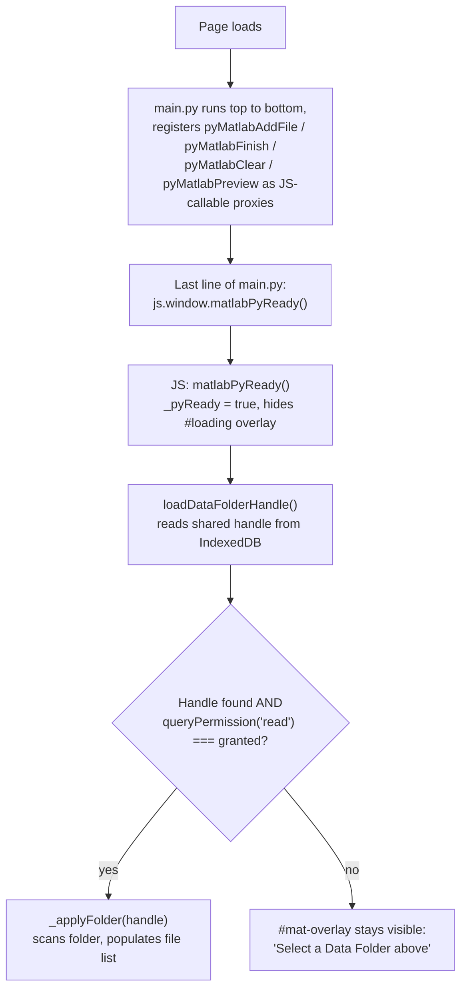
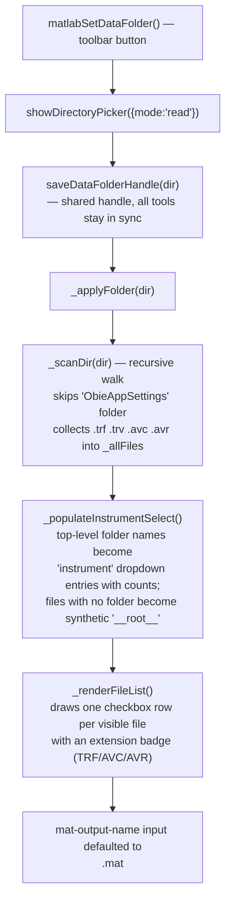
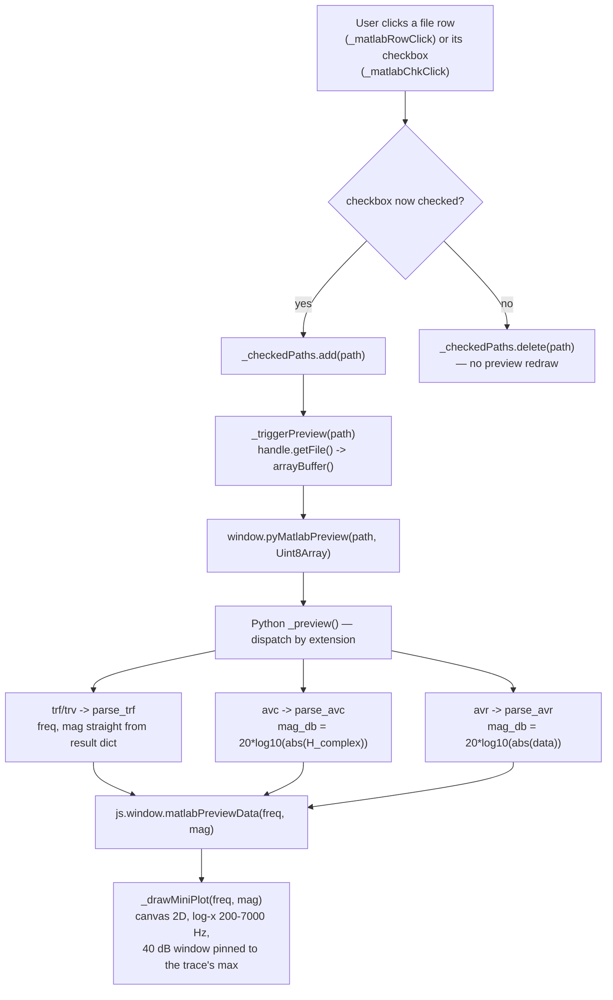
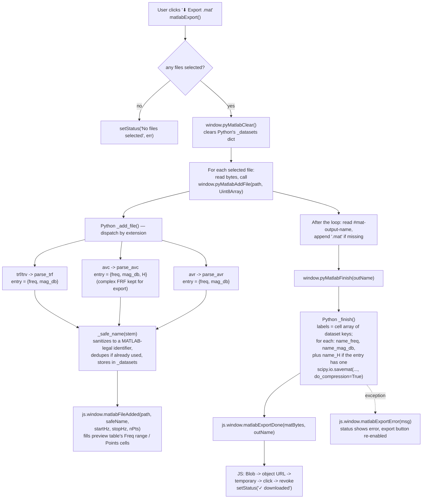

# MAT Viewer — Code Flow

> **Naming note:** the folder is `Web/tools/matlab/`, and the original brief for
> this document assumed a "MAT Viewer" that loads and plots existing `.mat`
> FRF files via `Python/fileio/mat_fileio.py`'s `parse_mat`/`parse_mat_bytes`.
> Reading the actual source shows the opposite: this tool's on-page title and
> breadcrumb are **"Export to MATLAB"**, and it runs in reverse — it reads
> existing `.trf`/`.trv`/`.avc`/`.avr` files from a Data Folder and **writes**
> a single aggregated `.mat` file for download. There is no call to
> `parse_mat`, `parse_mat_bytes`, or `mat_fileio.py` anywhere in `matlab.js`
> or `main.py` (`pyscript.toml` only pulls in `trf_fileio.py` and
> `avc_fileio.py`). This document describes the tool as it actually exists.

This documents how `matlab.js` (JS/UI, Data Folder scan, file selection,
canvas mini-plot, download) and `main.py` (PyScript — TRF/AvC/AvR parsing,
`.mat` assembly) work together.

- JS owns: the Data Folder picker (File System Access API), the recursive
  file scan and instrument-filtered file list, the checkbox selection state
  (`_checkedPaths`), the plain-`<canvas>` mini-plot preview, and turning the
  returned `.mat` bytes into a downloaded file. There is no Plotly in this
  tool — `index.html` doesn't even load `plotly.js`.
- Python (`main.py`) owns: parsing each selected file via `parse_trf`
  (`trf_fileio.py`) or `parse_avc` / `parse_avr` (`avc_fileio.py`),
  accumulating results in a module-level `_datasets` dict, and building the
  final `.mat` bytes with `scipy.io.savemat`.
- The two sides talk through `window.pyMatlab*` functions (JS → Python,
  registered via `create_proxy`) and `window.matlab*` callbacks
  (Python → JS), the same pattern as the other tools.

## 1. Page load / init sequence

## 2. Data Folder scan and file list

Changing the instrument dropdown calls `matlabInstrumentChange()` →
`_renderFileList()`, which re-filters via `_getVisibleFiles()`.
`matlabSelectAll()` / `matlabClearAll()` add/remove from `_checkedPaths` for
only the *currently visible* (filtered) files — not the full `_allFiles` set.

## 3. Row click → preview flow

Note: the right-panel preview table's "Freq range" / "Points" columns
(`pr-freq-<path>` / `pr-pts-<path>`) are **not** filled in by this preview
step — they stay `—` until Export actually runs and Python's `_add_file`
fires `matlabFileAdded` (see section 4). Clicking a row only draws the
bottom-left canvas mini-plot and updates the selection count.

## 4. Export flow

Output `.mat` variable naming (from the `main.py` docstring): a 1×N cell
array `labels`, plus per dataset `{name}_freq`, `{name}_mag_db`, and
`{name}_H` (AvC files only, complex FRF).

## 5. Other side features

| Feature | Functions | Notes |
|---|---|---|
| Instrument filter | `_populateInstrumentSelect`, `matlabInstrumentChange`, `_getVisibleFiles` | Top-level folder name = "instrument"; files with no parent folder are grouped under a synthetic `__root__` / "(no folder)" entry. |
| Select All / None | `matlabSelectAll`, `matlabClearAll` | Only affects the currently visible (filtered) file set, not every scanned file. |
| Sidebar resizer | inline `mousedown`/`mousemove`/`mouseup` listeners on `#mat-resizer` | Clamps `#matlab-files-panel` width to 180–520 px; plain JS, not a shared helper. |
| Help / Tips | `matlabHelp`, `matlabTips` | Open `../../Docs/experimental.html` and `../../Docs/shortcuts.html` in a new tab — differs from the project convention of a single Help button opening `../../Docs/index.html`, consistent with this tool's Experimental tier. |
| Mini plot | `_drawMiniPlot` | Plain `<canvas>` 2D drawing (no Plotly anywhere in this tool) — fixed log-frequency x-axis (200–7000 Hz), y-axis auto-ranges to a 40 dB window pinned to the selected trace's max value. |
| Data Folder handle | `matlabSetDataFolder`, `matlabPyReady` | Uses the shared `saveDataFolderHandle` / `loadDataFolderHandle` pattern from `obie-settings.js`, same as other tools. |
