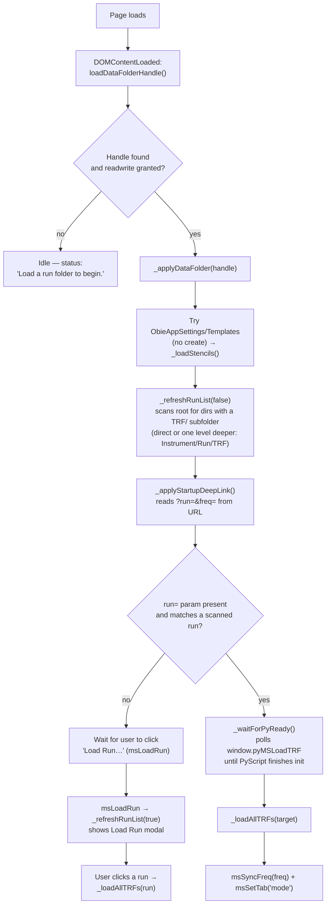
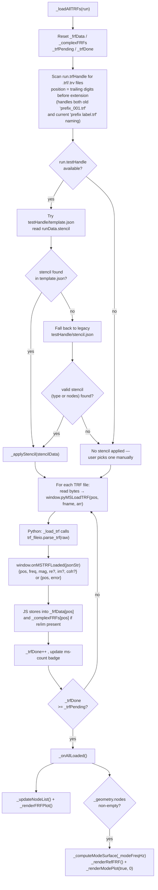
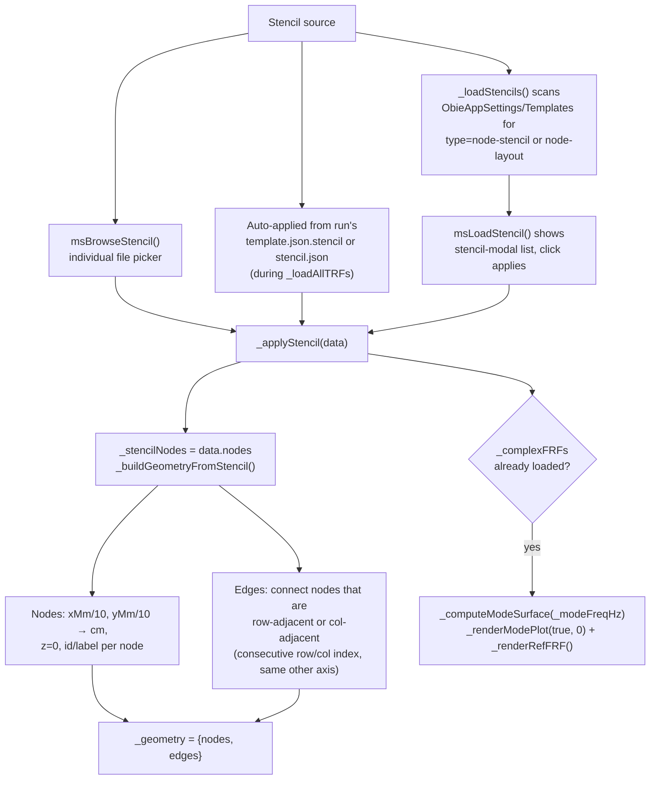
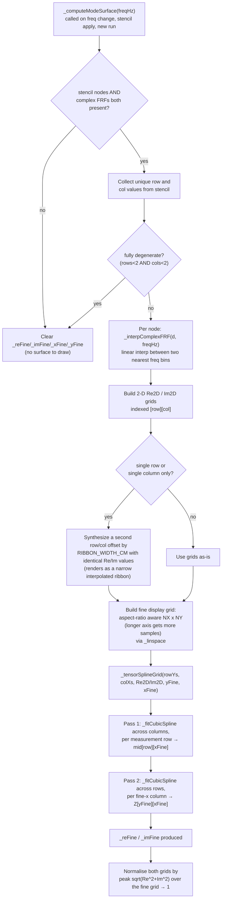
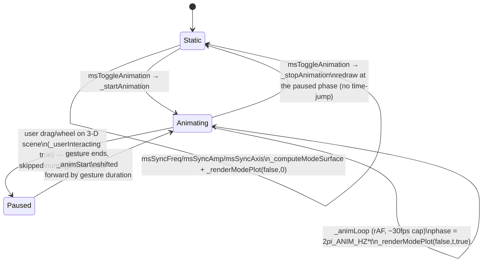
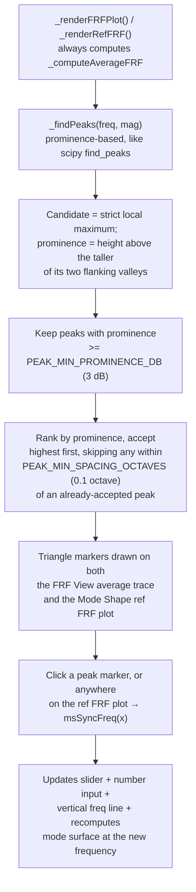

# Modal Analysis — Code Flow

This documents how `modeshape.js` (JS/UI, Data Folder access, Plotly rendering,
bicubic-spline interpolation, animation) and `main.py` (PyScript — TRF byte
parsing only) work together. Diagrams render natively on GitHub and in most
Markdown/Mermaid-aware editors.

Modal Analysis is **view-only** — all data acquisition happens in Acquire.
This tool is the browser counterpart of the desktop reference tool
`Python/mode_shape_viewer.py` (a PyVista viewer): both read a run's
`template.json`/`stencil.json` node stencil plus its `TRF/` complex-FRF files
and reconstruct an animated operating-deflection-shape surface via a bicubic
tensor-product spline. `mode_shape_viewer.py` uses
`scipy.interpolate.RectBivariateSpline`; `modeshape.js` reimplements the same
math (natural cubic spline, tensor-product: rows→columns then columns→rows)
directly in JS so it can run synchronously inside a `requestAnimationFrame`
loop with no Python/WASM round-trip per frame.

- JS owns: the UI, the Data Folder / File System Access API, run and stencil
  discovery, reading raw TRF bytes off disk, the bicubic-spline surface
  math, phasor/animation math, camera handling, and all Plotly rendering.
- Python (`main.py`, backed by `trf_fileio.parse_trf`, loaded locally from
  `Web/py/trf_fileio.py` per `pyscript.toml`) owns exactly one job: parsing a
  TRF file's bytes into `{freq, mag, re, im, coh}`.
- The two sides talk through a single JS → Python call
  (`window.pyMSLoadTRF`, one call per TRF file) and a single Python → JS
  callback (`window.onMSTRFLoaded`) — much thinner than Acquire's live
  bidirectional state machine, since there is no real-time capture here.

## 1. Overview — page load to a loaded run

**Why the deep link waits explicitly:** `_applyStartupDeepLink` fires
immediately from `DOMContentLoaded`, which can win the race against
Pyodide's own init (15–30 s on first load). Calling the not-yet-defined
`window.pyMSLoadTRF` would throw and leave the status stuck at
"Loading N TRF files…" forever, so `_waitForPyReady` polls every 100 ms
(60 s timeout) before proceeding. The deep link supports "View in Modal
Analysis" links from the Circle Fit tool (`?run=<path>&freq=<hz>`).

## 2. Loading a run's TRF files + stencil (old-format fallback)

## 3. Node stencil → spatial geometry model

## 4. Building the interpolated mode surface (bicubic spline)

`_fitCubicSpline` builds a natural cubic spline (second derivatives zero at
the endpoints) via the standard tridiagonal Thomas-algorithm solve;
`_evalCubicSpline` evaluates it (clamped linear extrapolation past the
endpoints). This is the from-scratch JS equivalent of
`scipy.interpolate.RectBivariateSpline` used by `mode_shape_viewer.py`.

## 5. Mode-shape reconstruction / animation pipeline

One animation frame evaluates the phasor formula
`disp[y][x] = amp * (Re_fine[y][x]*cos(phase) - Im_fine[y][x]*sin(phase))`
(`_applyPhasorGrid`, see math.html §6.1 for the derivation). Per-frame updates
during real playback (`isAnimFrame && plotEl._msBranch === 'surface'`) use a
fast-path `Plotly.restyle` of only the `z` and `marker.color` arrays on
traces `[0, 1]` — a full `Plotly.react()` every ~33 ms would pin the main
thread and rebuild the gl3d scene's interaction layer, blocking camera
drags/zoom/modebar clicks mid-animation. `_wireInteractionGuard` listens for
`mousedown`/`touchstart`/`wheel`/`plotly_relayouting` (the last is Plotly's
own event for an active gl3d camera drag, which bypasses normal DOM bubbling)
to set `_userInteracting`, so the animation loop never fights the user's own
camera gesture. When `_reFine`/`_xFine`/`_yFine` are unset (fully degenerate
stencil — no real row or column), `_renderModePlot` falls back to a
`scatter3d` ghost-lattice + deformed-lattice rendering instead of the
bicubic surface.

## 6. Rendering — FRF View tab vs. Mode Shape tab

| Trigger | What redraws |
|---|---|
| Node clicked in sidebar (`_updateNodeList`), avg toggle, frequency-band set/reset, new run loaded | `_renderFRFPlot()` — full node-by-node dB-vs-Hz plot on the **FRF View** tab, grayed/highlighted by selection, or collapsed to a single average trace (`_computeAverageFRF`) with peak markers when Average mode is on |
| Switching to the **Mode Shape** tab (`msSetTab('mode')`), avg toggle, new data | `_renderRefFRF()` — compact reference FRF plot with a draggable vertical frequency line; `plotly_click` on this plot calls `msSyncFreq(x)` |
| Frequency/amplitude/axis control change, view-mode toggle, stencil applied, run loaded | `_renderModePlot(resetCamera, t)` — dispatches to the 3-D animated `surface` branch, the `scatter3d` degenerate-lattice fallback, or (`_viewMode==='2d'`) `_renderContourPlot()`, a static Plotly `contour` trace using `_applyPhasorGrid(0)` (phase-0 snapshot) |
| Clicking a view-cube face | `_snapCameraToView()` — `Plotly.relayout` of `scene.camera` only, preserving the current zoom distance (`_currentCameraDistance`) |
| Camera icon / modebar `exportAnimation` button | `msExportAnimationVideo()` — captures one full oscillation cycle by blitting Plotly's live WebGL canvas directly (not `Plotly.toImage()`, which is too slow per-frame) into an offscreen canvas, recorded with `MediaRecorder` to a `.webm` |
| Resizing the FRF side panel, window resize | `_resizeModePlotPreservingCamera()` — captures `_liveCamera()` before `Plotly.Plots.resize()` and re-applies it after, since resize can itself reset a gl3d camera |

The FRF View plot and reference FRF plot are both plain 2-D Plotly line
charts (`scattergl`); the Mode Shape tab's main view is Plotly's `surface`
(gl3d) or `scatter3d`, never a raw canvas/WebGL app of its own — all
rendering goes through Plotly.

## 7. Peak detection + frequency selection

## 8. Other side systems

| System | Key functions | What it does |
|---|---|---|
| **Data Folder** | `msSetDataFolder`, `_applyDataFolder` | Standard `showDirectoryPicker()` + shared `saveDataFolderHandle`/`loadDataFolderHandle` pattern; on apply, re-scans stencils and run list |
| **Run discovery** | `_refreshRunList`, `msLoadRun`, `msRefreshRunList` | Scans the Data Folder root for any directory with a `TRF/` subfolder, either directly (`Root/Run/TRF`) or one level deeper (`Root/Instrument/Run/TRF`) |
| **Stencil modal** | `msLoadStencil`, `_renderStencilList`, `msBrowseStencil`, `msCloseStencilModal` | Lists stencils found in `ObieAppSettings/Templates/` (type `node-stencil`/`node-layout`), or lets the user browse to an arbitrary JSON file |
| **Deep link from Circle Fit** | `_applyStartupDeepLink`, `_waitForPyReady` | `?run=&freq=` URL params auto-load a run and jump straight to a frequency on the Mode Shape tab |
| **Average-only display** | `msToggleAverageOnly`, `_computeAverageFRF` | Toggles both the FRF View and reference FRF plots between per-node traces and a single averaged trace (linear-magnitude mean, converted back to dB) with gray context traces for the nodes that fed it |
| **Frequency band zoom** | `msSetFRFBand`, `msResetFRFBand` | Restricts the FRF View x-axis to a Hz range and renormalizes the y-axis to just the data inside that band (unlike Plotly's own zoom, which keeps the full-sweep y-range) |
| **View cube** | `_wireViewCube`, `msRotateViewCube`, `_snapCameraToView`, `_liveCamera` | A small CSS 3-D cube (independent of the real Plotly camera) whose arrow buttons spin its own display; clicking a face snaps the actual scene camera to that direction while preserving zoom distance |
| **Reference FRF panel toggle** | `msToggleRefFRF` | Shows/hides the absolute-positioned FRF overlay panel on the Mode Shape tab |
| **Video export** | `msExportAnimationVideo` | Renders exactly one oscillation cycle frame-by-frame (pacing to real wall-clock time via `setTimeout`), captured off the live WebGL canvas and encoded client-side with `MediaRecorder` — title/axis/colorbar text is not included since those are drawn in a separate Plotly layer from the WebGL canvas |
