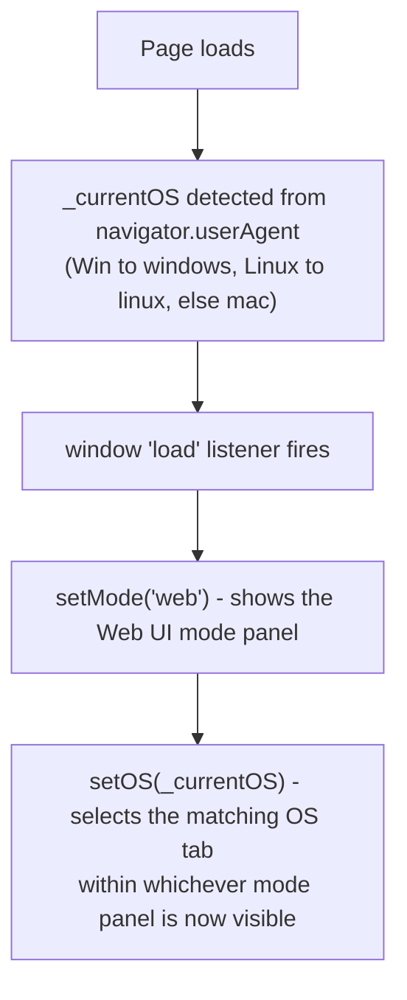
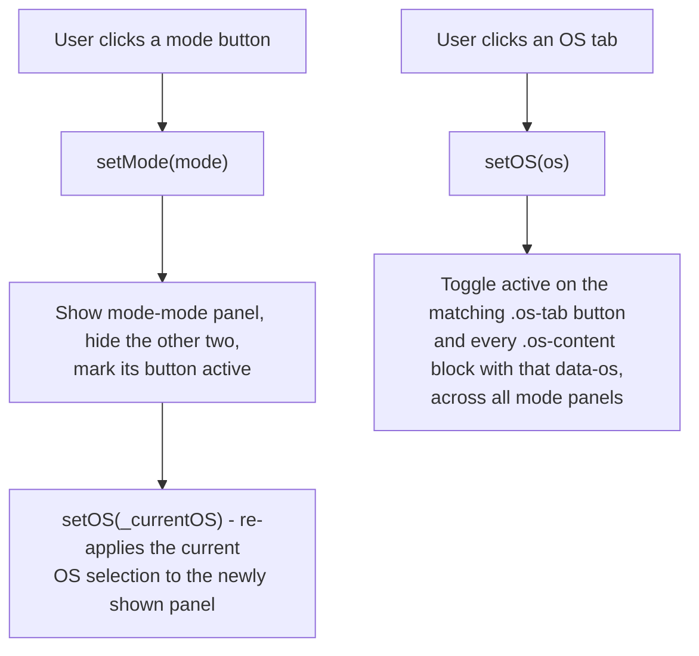

# Setup — Code Flow

This documents `setup.js`, the only script behind the Setup tool. Setup is a
**static instructions page** — OS tabs (Windows/Mac/Linux) nested inside mode
tabs (Web/Offline/Python) that show different copy-and-paste instructions.
There is no PyScript, no Data Folder, no audio, and no measurement logic —
just tab visibility toggling and a clipboard helper. The whole file is 54
lines, so one small diagram covers it.

## 1. Page load / init

## 2. Mode tabs and OS tabs

Two independent, nested tab systems, both driven by simple show/hide plus a
CSS `active` class toggle - no state machine, no persistence.

- **Mode tabs** (`web` / `offline` / `python`): `setMode(mode)` walks the
  three `mode-<id>` panels and `mode-<id>-btn` buttons, showing the one that
  matches and hiding the rest, then marking its button `active`. It always
  finishes by calling `setOS(_currentOS)`, because each mode panel has its
  own set of OS-specific content blocks that need re-syncing to whichever OS
  tab was last selected.
- **OS tabs** (`mac` / `windows` / `linux`): `setOS(os)` walks every
  `.os-tab[data-os]` button and every `.os-content` block on the page (across
  all three mode panels at once) and toggles the `active` class based on
  whether `data-os` matches. Because it's page-wide, picking an OS in one
  mode carries over if the user switches modes.

## 3. Copy-to-clipboard

`copyCode(btn)` finds the `<pre>` inside the button's enclosing `.code-block`,
writes its trimmed text to `navigator.clipboard`, and flips the button label
to "Copied" for 1500 ms before restoring the original text. Failures are
swallowed silently (`.catch(() => {})`) - there's no error UI, since a failed
clipboard write just means the button doesn't change.

## 4. Help / Tips links

Two toolbar buttons, each a one-line `window.open` to a Docs page in a new
tab - no modal, no in-page content:

| Button | Function | Target |
|---|---|---|
| Help | `setupHelp()` | `../../Docs/experimental.html` |
| Tips | `setupTips()` | `../../Docs/shortcuts.html` |
