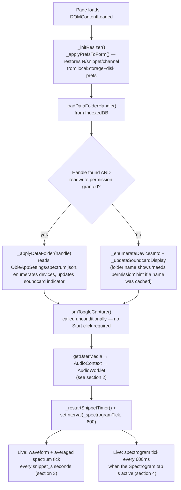
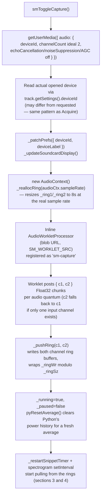
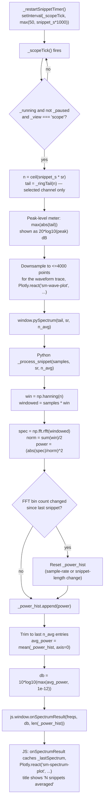
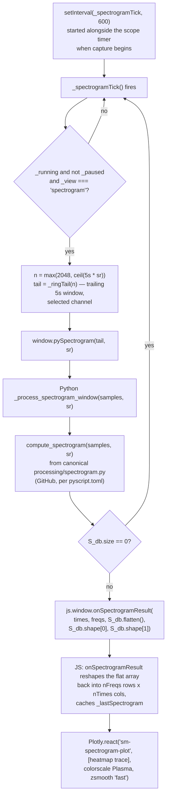
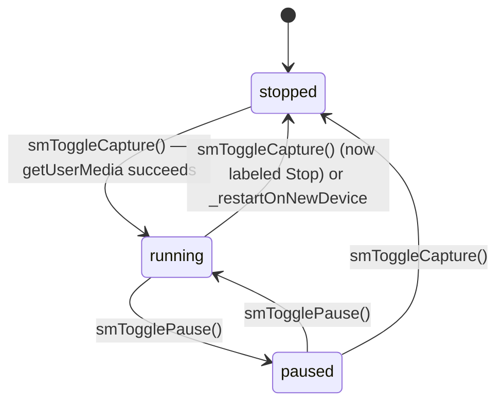

# Spectrum Monitor — Code Flow

This documents how `spectrum.js` (JS/UI, audio capture, Plotly rendering) and
`main.py` (PyScript — FFT/windowing/power-averaging math) work together.
Diagrams render natively on GitHub and in most Markdown/Mermaid-aware editors.

- JS owns: the UI, the Data Folder / File System Access API, audio capture
  (`getUserMedia` + `AudioWorklet`), the dual-channel ring buffers, the
  snippet/spectrogram tick timers, and all Plotly rendering.
- Python (`main.py`) owns: the Hann-window + `rfft` + linear-power averaging
  math for the spectrum (`_process_snippet`), and calls the canonical
  `processing/spectrogram.py` (`compute_spectrogram`, loaded from GitHub per
  `pyscript.toml`) for the spectrogram. There is no shared `Web/py` module for
  this tool's math — per the file's own header comment, audio capture has no
  Python equivalent and the FFT code is tool-specific, matching the LiveView
  precedent.
- The two sides talk through `window.py*` functions (JS → Python:
  `pySpectrum`, `pySpectrogram`, `pyResetAverage`) and `window.on*` callbacks
  (Python → JS: `onSpectrumResult`, `onSpectrogramResult`), wired up once
  `main.py` runs (`js.window.pySpectrum = create_proxy(...)` etc.) at the
  bottom of the module.

## 1. Overview — page load to live monitor

## 2. Audio capture pipeline

`_ringTail(n)` is the read side: it returns the last `n` samples of whichever
channel is selected (`_channel === 2 ? _ring2 : _ring1`), read backwards from
`_ringWr` with wraparound — this is what both the scope tick and the
spectrogram tick pull from.

## 3. Block-averaged spectrum computation

The averaging is a running window over **linear power** (not dB) — each new
snippet's power spectrum is appended to `_power_hist`, the list is trimmed to
the last `n_avg` entries, and only the mean of that list is converted to dB at
the end. Changing the **N (Averages)** or **Snippet** setting
(`smSettingsChanged`) restarts the JS timer at the new interval, but does not
by itself clear `_power_hist` — that only happens on a bin-count change
(different sample rate or snippet length) or an explicit `pyResetAverage()`
call (channel switch or capture start).

## 4. Spectrogram path

The spectrogram only actually redraws while the **Spectrogram** tab is the
active `_view` (`smSetView('spectrogram')`) — the 600ms timer keeps running
regardless of tab, but `_spectrogramTick` early-returns when the scope tab is
showing, and vice versa for `_scopeTick`. Switching tabs via `smSetView` also
force-fires one tick of whichever view just became visible (if capture is
running and not paused), so the newly-shown plot doesn't wait a full interval
to populate.

## 5. Pause/Resume, modebar visibility, and the trace-cache redraw helper

- `_pcfgFor()` computes the Plotly config on every redraw:
  `displayModeBar: !_running || _paused` — the grey modebar (zoom/pan/camera)
  is hidden while actively running, and shown whenever the monitor is stopped
  or paused, since that's the only time a frozen plot is worth zooming or
  exporting.
- `_redrawConfigOnly()` is the trace-caching redraw helper: it keeps the last
  rendered trace for each plot (`_lastWave`, `_lastSpectrum`,
  `_lastSpectrogram`) and re-issues `Plotly.react(...)` with the **same data**
  but a freshly computed `_pcfgFor()` config. This lets `smToggleCapture`,
  `_stopCapture`, and `smTogglePause` flip the modebar on/off instantly
  without waiting for the next tick to happen to recompute data.
- Pausing does **not** tear down the `AudioContext`/worklet/rings — audio
  keeps accumulating into the ring buffers in the background; `_scopeTick`
  and `_spectrogramTick` simply skip their work while `_paused` is true, so
  Resume picks back up with fresh (not stale) ring contents.
- `_restartOnNewDevice()` (called when the device-picker selection changes
  while running) does a full `_stopCapture()` → 120ms wait → `smToggleCapture()`
  cycle rather than a live device swap.

## 6. Other side systems

| System | Key functions | What it does |
|---|---|---|
| **Channel selector** | `smSetChannel(ch)` | Sets module-level `_channel` (1 or 2), toggles the Ch1/Ch2 button active state, persists via `_patchPrefs`, and calls `pyResetAverage()` so the spectrum's running power average doesn't mix samples from the old channel with the new one. `_ringTail` reads `_ring2` vs `_ring1` based on this flag — both channels are always being written by the worklet regardless of which is selected. |
| **View / tab selector** | `smSetView(v)` | Toggles `_view` between `'scope'` and `'spectrogram'`, shows/hides the corresponding `
`s, calls `Plotly.Plots.resize` on all three plot divs, and immediately fires one tick of the now-visible view if capture is running and unpaused. |
| **Averaging / snippet-length settings** | `smSettingsChanged()`, `_restartSnippetTimer()` | Reads the N-averages and snippet-length `<input>`s, patches prefs, and restarts the scope timer at the new interval (`setInterval(_scopeTick, snippet_s*1000)`). Does not itself reset `_power_hist` in Python — that happens implicitly in `_process_snippet` if the resulting FFT bin count changes. |
| **Settings persistence** | `_loadPrefs`, `_patchPrefs`, `_writeDiskPrefs`, `_applyPrefsToForm` | Layers `obieSpectrum_prefs` in `localStorage` under `_diskPrefs` (loaded from `ObieAppSettings/spectrum.json` in the shared Data Folder). Every change (device/channel/N/snippet) auto-persists to both — there's no explicit Save button, matching LiveView's pattern. |
| **Data Folder** | `smSetDataFolder`, `_applyDataFolder` | Standard shared-handle pattern: `window.showDirectoryPicker()` → `openObieAppSettings(dirHandle)` → `saveDataFolderHandle(handle)`. Shows the "new Data Folder" alert when `isNew` is true, then reads `spectrum.json` into `_diskPrefs` and re-enumerates devices. |
| **Device picker** | `smOpenDevicePicker`, `smCloseDevicePicker`, `smRecheckDevices`, `smApplyDeviceSelection`, `_enumerateDevicesInto`, `_updateSoundcardDisplay` | Mirrors Acquire's quick device picker: a modal listing `enumerateDevices()` audioinput entries (skipping `default`/`communications`), with a clickable `soundcard-ind` status-row label showing the current device. Selecting a new device while running triggers `_restartOnNewDevice()`. |
