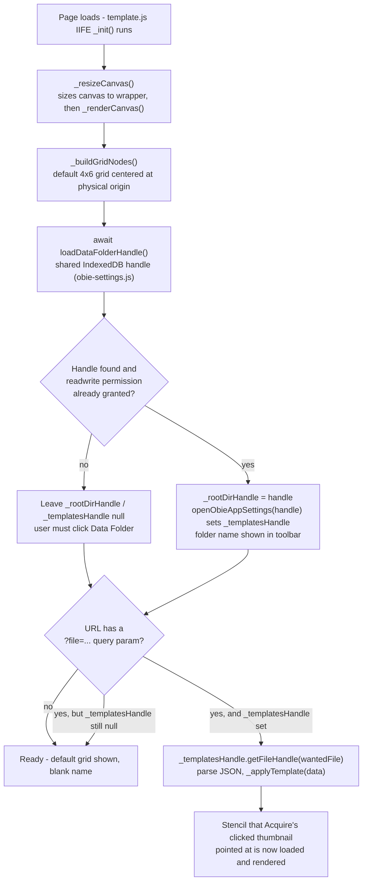
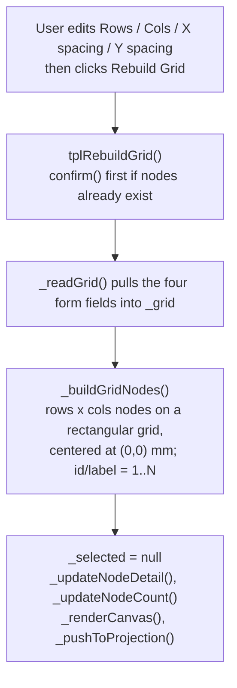
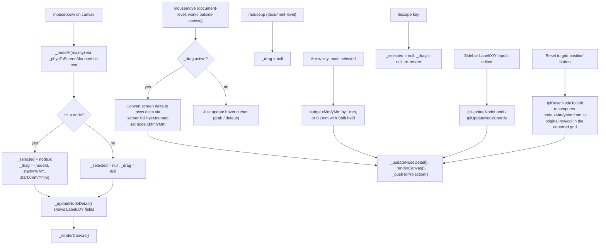
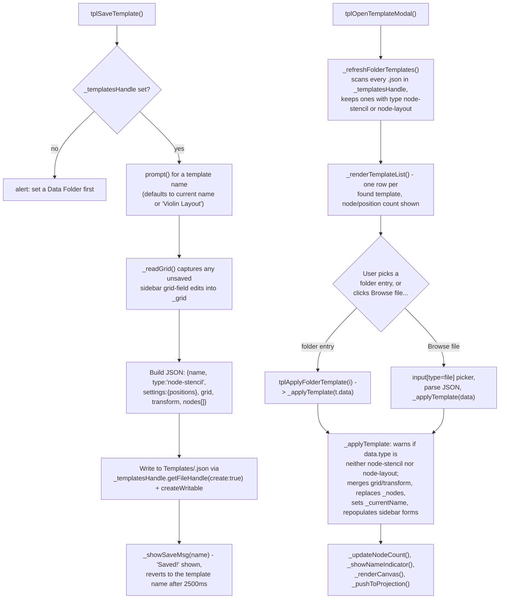
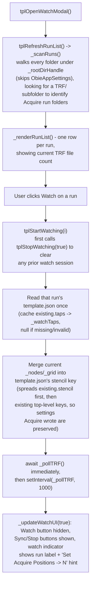
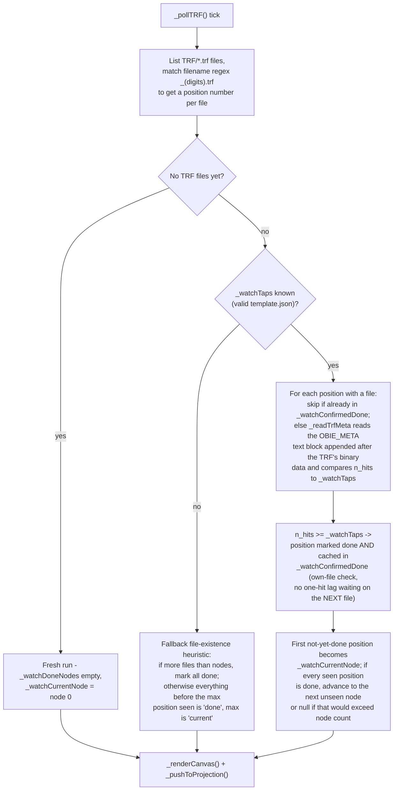
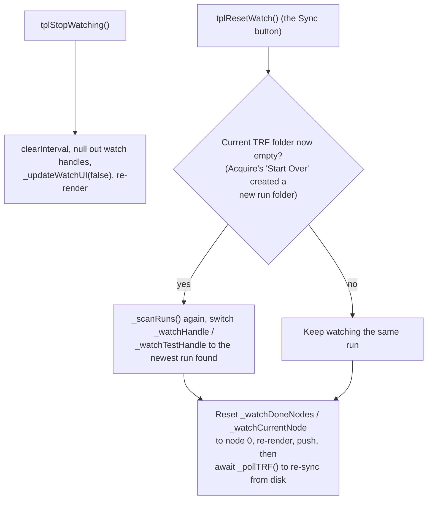
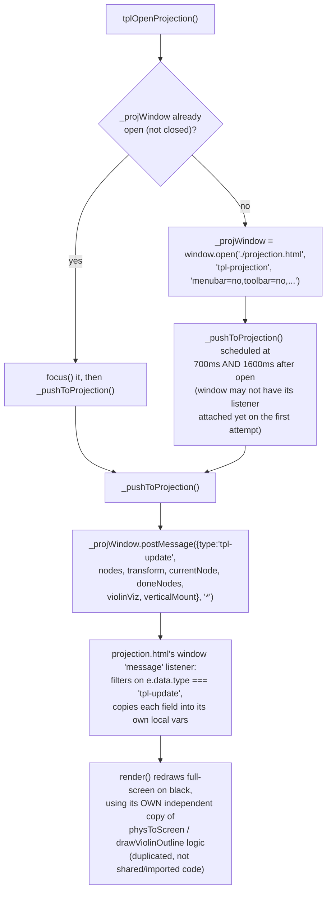

# Stencil Builder — Code Flow

This documents how `template.js` drives the Stencil Builder tool (folder:
`Web/tools/template/`). **There is no Python backend here** — no `main.py`,
no `pyscript.toml`, no PyScript `<script type="py">` tag in `index.html`.
The tool is pure vanilla JS + `<canvas>` 2D rendering. It never imports from
`Python/` or `Web/py/` because it does no signal processing or file-format
parsing — it only reads/writes plain JSON (`type: "node-stencil"`) and reads
the plain-text `OBIE_META` tail that Acquire appends after a TRF's binary
data (see `Python/fileio/trf_fileio.py`), which it parses with a small
byte-search helper (`_findBytes`) rather than a full TRF parser.

The page is really two cooperating documents:
- `index.html` + `template.js` — the editor: sidebar (grid, transform, violin
  reference, selected-node detail), toolbar, and the interactive canvas
  (`#tpl-canvas`) where nodes are laid out and dragged.
- `projection.html` — a separate, minimal full-screen window opened via
  `window.open()` that mirrors the same node layout on a black background
  for an actual video projector, driven entirely by `postMessage`.

## 1. Page load / init

`template.js`'s trailing `(async function _init() {...})()` IIFE runs on
load — there's no PyScript readiness gate to wait for, so setup is
synchronous/immediate other than the two `await`s below.

**The `?file=` auto-load.** This is how Acquire's stencil-thumbnail
click-through works: Acquire opens
`template/index.html?file=<templateFileName>.json`. On init, after the data
folder handle is restored from IndexedDB (so `_templatesHandle` is already
resolved), `_init` reads `new URLSearchParams(location.search).get('file')`
and, if present, fetches that exact file out of `_templatesHandle` and runs
it through the same `_applyTemplate()` used by the normal "Open Stencil"
modal. If the folder handle can't be silently restored (no stored handle,
or permission not already `granted`), the query param is silently ignored —
there is no re-prompt for permission during auto-load, only a
`console.warn` on failure.

## 2. Grid building and node editing

### 2a. Rebuilding the grid

`_buildGridNodes` centers the grid so node (0,0) sits at
`(-((cols-1)*xSpacing)/2, -((rows-1)*ySpacing)/2)` — i.e. the whole grid is
symmetric about the physical origin regardless of row/col count.

### 2b. Coordinate transform and canvas rendering

`_physToScreen(xMm, yMm)` is the core mapping: physical millimeters to
canvas pixels, using `_transform = { scale, xStretch, yStretch, rotation,
panX, panY }`. `scale` is px/mm; `xStretch`/`yStretch` allow independent
axis scaling (for projector keystone correction); `rotation` is applied
before translating by `panX`/`panY` from canvas center. `_screenToPhys` is
its algebraic inverse, used to convert a drag delta back into mm.

`_renderCanvas()` clears the canvas, draws a faint origin crosshair, then
(optionally, if `_verticalMount` is on) wraps the rest of the drawing in an
**extra** `ctx.translate/rotate(-90deg)/translate` around true canvas
center — this is a purely visual rotation applied at draw time, on top of
whatever `_physToScreen` already computed. It then draws the violin outline
(`_drawViolinOutline`), row/col connector edges between neighboring nodes,
and each node circle (color-coded — see below), always via `_physToScreen`.

**The vertical-mount hit-testing gotcha (documented directly in the code
comments above `_physToScreenMounted`):** mouse events report raw canvas
pixel coordinates, which are unaffected by the `ctx.rotate` used for
drawing. So hit-testing and dragging must apply that same extra -90°
rotation manually, or clicks land on a node's un-rotated (visually
displaced) position. `_physToScreenMounted` / `_screenToPhysMounted` exist
purely to re-apply that rotation for mouse math; `_renderCanvas` uses plain
`_physToScreen` (rotation is done via canvas transform instead), while
`_nodeAt` and the drag handlers use the `...Mounted` variants.

### 2c. Node color coding (drawn by `_renderCanvas`)

| State | Fill | Meaning |
|---|---|---|
| Selected (not watching) | orange `#ff9944` with orange halo | Currently selected for sidebar editing |
| Current node (watching) | yellow `#ffdd00` with yellow halo | Next node Watch Run expects a hit at |
| Done (watching) | dim green-gray `rgba(60,90,60,0.45)` | Watch Run confirmed this position complete |
| Pending (watching, not current/done) | muted blue `rgba(80,140,255,0.50)` | Not yet reached |
| Normal (not watching) | blue `rgba(80,140,255,0.88)` | Default idle appearance |

### 2d. Dragging, keyboard nudge, sidebar fields

## 3. Save / Load flow

`_applyTemplate` is the single entry point used by all three load paths
(folder-template click, Browse-file picker, and the `?file=` auto-load in
`_init`) — it's tolerant of both the current `node-stencil` shape and an
older `node-layout` type tag, and of files missing `grid`/`transform`
entirely (it merges onto the existing in-memory defaults rather than
requiring every key).

Templates can also be deleted from the modal (`tplDeleteFolderTemplate`,
with a `confirm()` and `_templatesHandle.removeEntry`).

## 4. Watch Run — live projection mode

"Watch Run" has no direct coupling to Acquire's code — it works purely by
polling the shared Data Folder's file layout that Acquire also writes to
(`<instrument>/<run>/TRF/*.trf` and `<instrument>/<run>/template.json`).

### 4a. Selecting a run and starting the watch

### 4b. The poll loop and done-detection

`_readTrfMeta` never throws: a missing `OBIE_META` marker (older TRF, or a
file still being written) just returns `{}`, which is treated as "not done
yet" rather than an error.

### 4c. Stopping and syncing

### 4d. Driving `projection.html`

The projector window is **not** a shared worker or `BroadcastChannel` — it
is a plain popup window (`window.open`) driven by `window.postMessage`.

`_pushToProjection()` is called after essentially every state-changing
action in the editor: node drag, keyboard nudge, transform slider input,
grid rebuild, template load/apply, violin toggle/orientation/opacity
change, vertical-mount toggle, and every `_pollTRF` tick while watching. If
`_projWindow` is null or closed, it's a silent no-op — the editor doesn't
require the projection window to be open.

## 5. Other side systems

| System | Key functions | What it does |
|---|---|---|
| **Violin reference overlay** | `tplToggleViolin`, `tplSetViolinOrientation`, `tplSetViolinOpacity`, `_drawViolinOutline` | Draws `violin-outline.svg` under the nodes at a configurable opacity (5-80%) and orientation (vertical/horizontal), scaled/rotated through the same `_transform`. `projection.html` has its own independent copy of this drawing logic (`drawViolinOutline`), kept in sync only via the `violinViz` field in the `tpl-update` postMessage payload. |
| **Vertical projector mount** | `tplToggleVerticalMount` | Flips `_verticalMount`, which adds a -90 degree canvas-transform rotation in both `_renderCanvas` and `projection.html`'s `render()`, and switches node hit-testing/dragging to the `...Mounted` coordinate helpers (section 2b). Toggles the toolbar button's `accent` class as an on/off indicator. |
| **Node detail sidebar** | `_updateNodeDetail`, `tplUpdateNodeLabel`, `tplUpdateNodeCoords`, `tplResetNodeToGrid` | Shows/hides based on `_selected`; label/X/Y fields write straight back into the selected node object and trigger a re-render + projection push on every keystroke (`oninput`). |
| **Data Folder** | `tplSetDataFolder` | Standard shared-handle pattern: `window.showDirectoryPicker({mode:'readwrite'})`, `saveDataFolderHandle`, `openObieAppSettings` (alerts if `isNew`). Same convention as Explore/Acquire. |
| **Help** | `tplHelp` | Opens `../../Docs/index.html` in a new tab, per the standard toolbar convention. |
| **Canvas resize** | `_resizeCanvas` | Bound to `window.resize`; re-sizes the canvas element to its wrapper's current client size and re-renders — no debouncing. |
