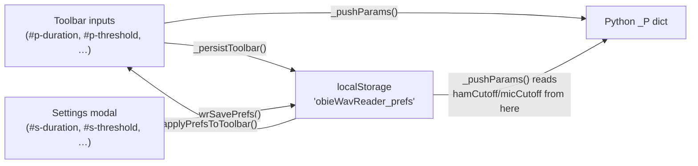
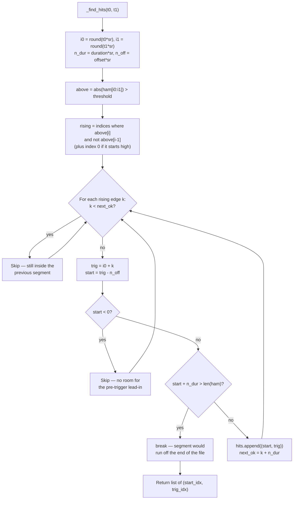
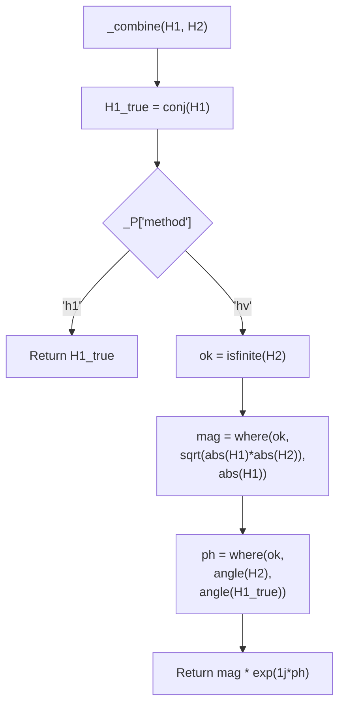
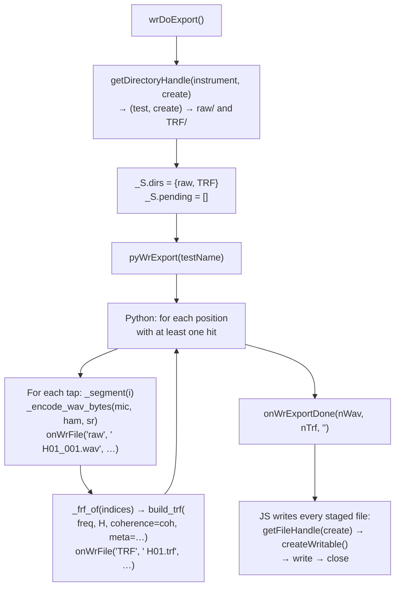

# WAV Reader — Code Flow

This documents how `wavreader.js` (JS/UI, cursors, Plotly rendering, writing to
disk) and `main.py` (PyScript — WAV parsing, hit detection, FRF, TRF/WAV byte
building) work together. WAV Reader is an **Experimental**-tier tool: the
after-the-fact counterpart to Acquire. Where Acquire captures hits live from an
audio device, WAV Reader takes one long two-channel recording made in any audio
app and splits it into a complete test run.

It is a browser port of the LabVIEW `Main_WAV_Reader.vi` (`LabVIEW/Code/
ViolinSubs/WAV_2019/`), including `Subdivide.vi` (hit splitting) and the
`CalculateFromWAV.vi` export path.

- **JS owns**: the file `<input>`, the two draggable cursors, the draggable
  threshold line, the position/tap sidebar, all Plotly rendering, the
  File System Access API writes, and localStorage prefs.
- **Python owns** (`main.py`): WAV parsing via the canonical
  `Python/fileio/wavfileio.py`, threshold hit detection, envelope downsampling,
  time cutoffs, FRF + coherence via `Python/processing/frf.py`, TRF bytes via
  `Python/fileio/trf_fileio.py`, and 16-bit WAV encoding. **No DSP lives in the
  JS.**
- The two sides talk through `window.pyWr*` (JS → Python) and `window.onWr*`
  (Python → JS), plus `window.onPyReady` fired once from the bottom of `main.py`.

## 0. Files and where things live

| File | Contains |
|---|---|
| `index.html` | Shell, two toolbar rows, five plot divs, Settings modal, Export modal |
| `wavreader.js` | All UI logic. ~880 lines, sectioned by banner comments |
| `main.py` | All DSP and file building. Module-level state `_ham`/`_mic`/`_sr`/`_filename`/`_hits`, params in `_P` |
| `wavreader.css` | Tool-local layout. White theme, redeclares `--bg-deep`/`--border` but **never** `--header-bg`/`--header-border` (see CLAUDE.md Rule 3b) |
| `pyscript.toml` | `numpy` + `scipy` (scipy is required by `wavfileio.py`), three modules pulled from GitHub `main` |

### Bridge functions

| JS → Python | Purpose |
|---|---|
| `pyWrSetParams(jsonStr)` | Merge a JSON blob into `_P`. Unknown keys ignored |
| `pyWrLoad(uint8, filename)` | Parse a WAV, emit the overview |
| `pyWrAnalyze(t0, t1)` | Detect hits in the cursor window, emit summary + all-hits FRF |
| `pyWrSelectHit(idx)` | Emit the three detail plots for one tap |
| `pyWrSelectPosition(pos)` | Emit the FRF for one position, or `-1` for all hits |
| `pyWrGetAudio(t0, t1)` | Hand the mic samples in the window back for playback |
| `pyWrExport(testName)` | Stream every output file to JS, then signal completion |

| Python → JS | Purpose |
|---|---|
| `onWrLoaded(t, ham, mic, sr, durationSec, fname, nCh)` | File parsed; arrays are envelope-downsampled |
| `onWrAnalyzed(trigs, counts, nHits, nPos, freq, Hdb, coh, nUsed)` | Hit detection done |
| `onWrHit(t, ham, mic, f, spec, idx, pos, tap, label)` | One tap's detail plots |
| `onWrFRF(freq, Hdb, coh, label, nUsed)` | FRF for the current selection |
| `onWrAudio(samples, sr)` | Mic samples for playback (`null` if the window is empty) |
| `onWrFile(kind, name, bytes)` | One finished file. `kind` is `'raw'` or `'TRF'` |
| `onWrExportDone(nWav, nTrf, err)` | Export finished; `err` is `''` on success |
| `onWrError(fname, msg)` | Any Python exception, truncated to 200 chars |

## 1. Overview — file to exported run

```mermaid
flowchart TD
    A["Page loads"] --> B["DOMContentLoaded:\n_applyPrefsToToolbar, _updateFreqRes,\n_initResizer, _clearDetailPlots"]
    B --> C["loadDataFolderHandle()\noffer it as the export destination\nif readwrite permission already granted"]
    C --> D["onPyReady fires from main.py\n_S.pyReady = true, _pushParams()"]
    D --> E["User picks a WAV\nwrLoadWav(input)"]
    E --> F["_readAndSend: file.arrayBuffer()\n_pushParams(), pyWrLoad(bytes, name)"]
    F --> G["Python load_file():\nwavfileio.load_wav_bytes, _normalise,\nassign hammer/mic by _P['first_mic']"]
    G --> H["onWrLoaded → cursors reset to full span\n_drawOverview(), _scheduleAnalyze()"]
    H --> I["pyWrAnalyze(cur0, cur1)"]
    I --> J["Python analyze():\n_find_hits → group → _frf_of(all)"]
    J --> K["onWrAnalyzed → _renderPositionSelect,\n_renderHitList, auto-select a hit, draw FRF"]
    K --> L{"User adjusts\ncursors / threshold / params?"}
    L -- yes --> I
    L -- no --> M["wrExport() → modal"]
    M --> N["wrPickFolder(): showDirectoryPicker\n+ saveDataFolderHandle + openObieAppSettings"]
    N --> O["wrDoExport(): create\n<instrument>/<test>/raw and /TRF"]
    O --> P["pyWrExport(test) → Python streams\nfiles via onWrFile into _S.pending"]
    P --> Q["onWrExportDone writes every\nstaged file with createWritable()"]
```



## 2. Parameters — one source of truth

Every parameter lives in **three** places and must stay in step. This is the
most common source of bugs when editing this tool.



- `DEFAULTS` in `wavreader.js` holds the LabVIEW front-panel values
  (duration 0.3, offset 0.001, positions 12, taps 4, setType `H`,
  threshold 0.2, hamCutoff 0.002, micCutoff 0.3) plus plot prefs
  (xMin 100, xMax 10000, dbRange 45).
- `_pushParams()` reads **duration / offset / positions / taps / setType /
  threshold** from the toolbar inputs, but **hamCutoff / micCutoff** from
  localStorage (they only exist in the Settings modal, not the toolbar).
  `method` and `first_mic` come from the two toolbar `<select>`s.
- `_P` in `main.py` mirrors the same keys in snake_case. `set_params()` coerces
  by key name — ints for `positions`/`taps`, strings for `set_type`/`method`,
  bool for `first_mic`, floats for everything else.

**To add a parameter**, touch all of: `DEFAULTS`, the HTML input, `_pushParams`,
`_persistToolbar` (if in the toolbar), `_populatePrefsForm` + `wrSavePrefs`
(if in the modal), `_applyPrefsToToolbar`, and `_P` in `main.py`.

### `freq res` is a readout, not an input

`#p-freqres` is a `<span class="tb-readout">`, updated by `_updateFreqRes()` to
`(1 / duration).toFixed(2) + ' Hz'`. One FFT over a Duration-long segment fixes
the bin spacing at 1/Duration; the TRF keeps that native grid rather than
resampling onto a coarser one. The LabVIEW panel had this as an editable field —
it was deliberately made read-only. Don't re-add it as an input without deciding
what resampling should mean for the exported TRF.

## 3. Channel assignment — read this before touching anything audio

The hammer/mic left-right order is **inconsistent across this repo**:

| Source | Order |
|---|---|
| `Web/py/acquire_logic.py` (`_encode_wav_bytes(mic_win, ham_win, sr)`) | L = mic, R = hammer |
| `Web/tools/wavview/main.py` (`_swap_channels = False`) | L = mic, R = hammer |
| `Python/SampleData/Test violin/Raw/*.wav` | **L = hammer, R = mic** |
| `Web/Docs/experimental.html`, WAV Viewer section | **L = hammer** (agrees with the samples, contradicts the code) |

WAV Reader therefore **never assumes**: the `First channel` dropdown
(`#first-ch-sel`) controls `_P['first_mic']`, defaulting to `Microphone`
(L = mic) to match Acquire and the LabVIEW panel default.

```python
# main.py load_file()
_mic, _ham = (ch_a, ch_b) if _P['first_mic'] else (ch_b, ch_a)
```

A quick discriminator when debugging: the **hammer is unipolar** (a one-sided
positive spike from the load cell); the **mic oscillates about zero**. If the
"Microphone" plot shows a single positive spike, the selector is the wrong way
round.

Changing the selector re-parses the file rather than just re-analysing —
`wrParamChanged()` calls `_firstChDirty()`, and on a change calls
`_reloadCurrentFile()`, which re-reads `_lastFile` (the `File` object kept from
the picker) and returns early.

## 4. Hit detection — `Subdivide.vi`



`next_ok = k + n_dur` is the minimum-separation rule: a second crossing inside
one Duration window is ignored. **This is what rejects hammer double-bounces** —
if users report double-counted hits, Duration is too short, not the threshold.

`_hits` holds absolute sample indices into the full file, so it stays valid
across cursor moves without re-slicing the audio.

## 5. Segment extraction and time cutoffs

`_segment(idx)` returns `(hammer, mic)` for one hit, with cutoffs applied the
same way `acquire_logic._h1_from_st` does — **zeroed past the cutoff, not
truncated**, so every segment keeps the same length and therefore the same FFT
bin spacing:

```python
ham_cut = n_off + int(round(_P['ham_cutoff'] * _sr))   # measured from the trigger
if 0 < ham_cut < len(h):
    h[ham_cut:] = 0.0
```

Consequence for plotting: with the default 0.002 s hammer cutoff, only ~0.8% of
a 0.3 s segment is non-zero. `onWrHit` therefore zooms the hammer plot's x-axis
to `[-offset, max(hamCutoff * 4, 0.005)]` — otherwise the pulse is an invisible
sliver at the far left.

Grouping is pure integer arithmetic, no state: hit `i` belongs to position
`i // taps`, tap `i % taps`. `_pos_label(i)` returns `f"{set_type}{i+1:02d}"`,
matching `acquire_logic._pos_label` (H01, H02, …).

## 6. FRF — `frf.py` plus the LabVIEW Sqrt(H1·H2)

`frf.py` defines the cross-spectrum as `S_fp = F * conj(P)`. The consequences
catch everyone:

- `H1 = S_fp / S_ff` is the **conjugate** of the true mic/hammer FRF.
  `np.conj(H1)` is the true one.
- `H2 = S_pp / S_fp = P / F` **is** the true FRF, which is why Acquire exports
  H2 (see the comment in `acquire_logic._h1_from_st`).
- `H2` has **no guard on its denominator**. Where the hammer spectrum vanishes —
  at the nulls of a short impulse — it goes `inf`/`nan`.

`_combine(H1, H2)` handles all three:



`'hv'` (the default, matching LabVIEW) is the geometric mean of the two
estimator magnitudes carried on H2's phase. H1 under-reads when the hammer
channel is noisy, H2 over-reads when the mic channel is; the geometric mean sits
between them. Bins where H2 is undefined fall back to H1.

> When editing `_combine`, note the `np.where(ok, H2, 0.0)` / `np.where(ok, H2,
> 1.0)` inner guards: they exist so `abs()` and `angle()` never *evaluate* on
> `inf`/`nan`, which would emit a RuntimeWarning even though the outer `where`
> discards the result.

`_frf_of(indices)` is the single entry point — it builds an `FRFAccumulator`,
`add_hit`s every segment, calls `compute_frf`, applies `_combine`, and returns
`(freq, H_complex, H_dB, coh, n_hits)`. Both the on-screen FRF and the exported
TRF go through it, so they can never disagree.

## 7. The two draggable overlays

Both use Plotly editable shapes (`config.edits.shapePosition`) with per-shape
`editable` flags, and both read the move out of `plotly_relayout`.

| Overlay | Plot | Shape indices | Handler |
|---|---|---|---|
| Cursors 0 / 1 | `wr-overview-plot` | 0 = shaded rect (`editable:false`), **1 = cursor 0**, **2 = cursor 1** | `_wireOverviewDrag`, matches `/^shapes\[(\d+)\]\.x0$/` |
| Threshold | `wr-ham-plot` | **0 = +threshold (`editable:true`)**, 1 = −threshold mirror, 2 = hammer cutoff marker | `_wireThresholdDrag`, reads `shapes[0].y0` |

**Shape order is load-bearing.** Inserting a shape without updating the index
match silently breaks dragging. The mirror line and cutoff markers are
explicitly `editable: false` so only one handle changes each value.

### Two things that make the cursors actually grabbable

Plotly gives each editable shape an invisible companion `<path>` with
`cursor: move; stroke-width: 10` — the grab target is only ~10px wide. Two
settings in `_drawOverview` exist purely so the user can hit it:

- **`pad` on the x-axis range** (`range: [-pad, duration + pad]`, pad = 2% of
  duration). On load the cursors sit at `0` and at the file duration. Without
  the pad they land exactly on the plot boundary, where half the 10px handle is
  outside the plot area and the left one overlaps the y-axis — effectively
  ungrabbable, which is indistinguishable from "dragging is broken".
- **`dragmode: false`** on this plot. With Plotly's default `'zoom'`, a
  near-miss rubber-bands a zoom box instead of moving the cursor: the axis
  rescales, the Window fields don't change, and it reads as the cursor refusing
  to move. Disabling drag means a miss simply does nothing. Exact values are
  still typeable in `#p-cur0`/`#p-cur1`, so no capability is lost.

> **Testing note:** a single-jump synthetic drag (one mousedown, one mousemove,
> one mouseup) does **not** move a Plotly shape — its drag logic needs a run of
> intermediate `mousemove` events on `document`. Automated drag helpers often
> emit only one, so a passing-looking test harness can report "drag does
> nothing" when the app is fine. Verify with ~10 stepped mousemoves, and use
> `document.elementFromPoint()` to confirm the handle (not `rect.nsewdrag`) is
> the topmost element at the cursor's pixel.

> **Gotcha that already bit once:** `Plotly.react()` is async, and Plotly only
> attaches `.on()` to a graph div *after* it has drawn into it. Wiring must be
> `Plotly.react(...).then(_wireX)`, never a synchronous call afterwards — that
> throws `document.getElementById(...).on is not a function`, which surfaces
> confusingly as a Python error via `onWrError` (the exception propagates back
> through the `js.window.onWrLoaded(...)` call inside Python's `try`). Each wire
> helper also resets its own `_xWired` flag if `.on` is still missing, so it can
> retry on the next draw.

Cursor moves are debounced through `_scheduleAnalyze()` (140 ms) so dragging
doesn't re-run hit detection on every mouse event. Cursors are also typeable via
`#p-cur0`/`#p-cur1` (`wrCursorTyped`), and both paths swap the values if the
user crosses them over.

## 8. Plots

| Div | Content | Notes |
|---|---|---|
| `wr-overview-plot` | Full recording, mic (blue) + hammer (red) | Envelope-downsampled in Python. Yellow cursors + shaded selection |
| `wr-ham-plot` | One tap's hammer pulse | Auto-zoomed to the live region; draggable purple threshold |
| `wr-mic-plot` | Same tap's mic response | Grey dotted mic-cutoff marker |
| `wr-spec-plot` | Hammer spectrum, **normalised to a 0 dB peak** | Log x, `[xMin, xMax]`, y `[-dbRange, 2]`. No window function — the pulse already decays to zero, and a Hann would suppress the spike itself |
| `wr-frf-plot` | FRF + coherence | Coherence rescaled into the bottom 25% of the Y range so it needs no second axis |

FRF Y-axis autoscales off the **99th percentile of in-band dB values** so one
spike can't squash the curve. `_wireFRFRelayout` captures manual zooms into
`_S.yMin/yMax`; `wrRescaleY()` clears them. `_clearDetailPlots()` hides the axes
(`xaxis.visible: false`) — an empty Plotly plot otherwise draws a meaningless
−1…2 grid.

`_drawFRF` is called two ways, which is worth knowing: `onWrAnalyzed` always
receives the **all-hits** FRF, so when a specific position is selected it
ignores that payload and calls `pyWrSelectPosition` instead. `_renderPositionSelect`
runs **before** `_renderHitList` because it can clamp `_S.activePos`.

## 9. Export



Python **stages** files through `onWrFile` rather than writing them; JS does all
the disk I/O in `onWrExportDone`. Keeps the async File System Access API out of
Python.

Output layout is deliberately byte-compatible with Acquire, so an exported run
opens directly in Explore and Modal Analysis:

| Path | Contents |
|---|---|
| `<instrument>/<test>/raw/<test> H01_001.wav` | One 16-bit stereo WAV per tap, **L = mic, R = hammer**. Tap numbering restarts at `_001` for each position |
| `<instrument>/<test>/TRF/<test> H01.trf` | One TRF per position, `fComplex=2.0` (re, im, γ² per bin) plus the `OBIE_META` block |
| `<instrument>/<test>/<test> H.avc` | Complex mean of the per-position FRFs, via `avc_fileio.build_avc` |
| `<instrument>/<test>/<test> H.avr` | Mean of the per-position **magnitudes**, via `build_avr` |
| `<instrument>/<test>/Settings.json` | Run-settings snapshot, same schema as a desktop run |
| `<instrument>/<test>/Notes.txt` | Provenance — which WAV this was translated from, and which slice |

Files land in one of **three** `_S.dirs` buckets, keyed by the `kind` Python
passes to `onWrFile`: `'raw'`, `'TRF'`, or `'root'` (the test folder itself —
Notes, Settings and the AvC/AvR pair). Adding a fourth output location means
adding a bucket in `wrDoExport` as well as a `kind` in `export_files`.

AvC/AvR mirror `acquire_logic._emit_averages`: AvC is the phase-coherent
complex mean, AvR the mean of the magnitudes. Because `|mean(H)| ≤ mean(|H|)`,
AvR always sits at or above AvC in magnitude — a useful sanity check. Acquire
writes one pair *per prefix group*; WAV Reader has a single group (Set Type),
so there is exactly one pair.

`Settings.json` follows the desktop schema (see
`Python/SampleData/Test violin/Settings.json`) — `data` / `audio` / `display` /
`trigger` / `run` — plus a WAV-Reader-only `source` block recording
`translated_from`, the estimator used, the cutoffs and the cursor window. The
`display.freq_min/freq_max` values come from the JS plot prefs, pushed into
`_P` by `_pushParams` purely so this file can record them.

On success the modal closes itself (`wrCloseExport()` from `onWrExportDone`)
and the outcome is reported in the status line, which stays visible. On failure
the modal **stays open** with the error in `.save-msg` so the user can retry
without re-entering the names.

`_encode_wav_bytes` is a deliberate copy of `acquire_logic._encode_wav_bytes`
(the source module is a browser capture state machine and can't be imported
here). **If one changes, change both.**

TRF meta keys follow Acquire's schema (`sample_rate`, `bit_depth`, `n_hits`,
`threshold`, `ham_cutoff`, `mic_cutoff`, `device`) plus two of this tool's own:
`method` (`Sqrt(H1H2)` or `H1`) and `source_wav`.

### Destination folder

Input is a plain file picker (no Data Folder browse button — CLAUDE.md Rule 4
was answered "individual file picker"), but export still needs somewhere to
write. `wrPickFolder()` calls `showDirectoryPicker({mode:'readwrite'})`, then
`saveDataFolderHandle(dir)` and `openObieAppSettings(dir)` so the shared handle
and the settings/templates/bands/colors folders stay in step with every other
tool, alerting on `isNew`. On page load, an already-granted shared handle is
offered as the destination so the common case needs no second pick.

## 10. Testing without a browser

`main.py` imports `js` and `pyscript.ffi`, but everything else is plain CPython.
Stub those two modules, put `Python/processing` and `Python/fileio` on
`sys.path`, and the whole pipeline is drivable headlessly — `set_params`,
`load_file`, `analyze`, `select_hit`, `select_position`, `export_files` — with
`onWr*` calls collected into a list. `scipy` is needed (for `wavfileio`).

Two things that will mislead you when building synthetic test audio:

- A very short synthetic hammer pulse has its **first spectral null** inside the
  audio band (≈1.5·sr/L for an L-sample half-sine). Dividing by a near-zero
  input spectrum makes the FRF peak *there*, not at your injected resonance.
  Use a pulse short enough (~0.2 ms at 48 kHz) that the null sits above the band
  you assert on.
- The hammer is zeroed past `ham_cutoff`, so its tail is always exactly zero —
  probe the **mic** trace when checking channel assignment, never the hammer's.

## 11. Known gaps / possible next steps

- Threshold has no auto-suggest. The LabVIEW default of 0.2 is far too high for
  quiet recordings (the repo's own sample captures peak at 0.013–0.08), so the
  first thing a new user must do is lower it. A "suggest from hammer peak"
  button would remove the main stumbling block.
- Playback is mic-only and plays the whole cursor window; LabVIEW's Play did the
  same, but per-tap playback would be more useful.
- No AvC/AvR export — Acquire writes those, WAV Reader does not.
- `Set Names` from the LabVIEW Params cluster is not implemented; only
  `Set Type` (the label prefix) is.
