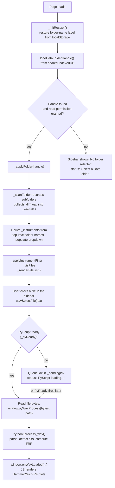
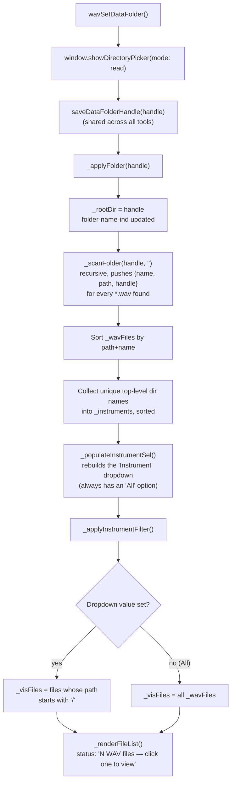
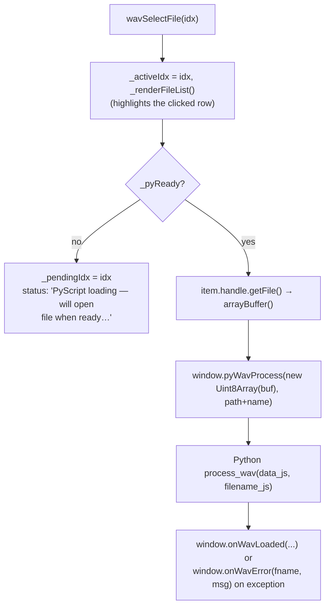
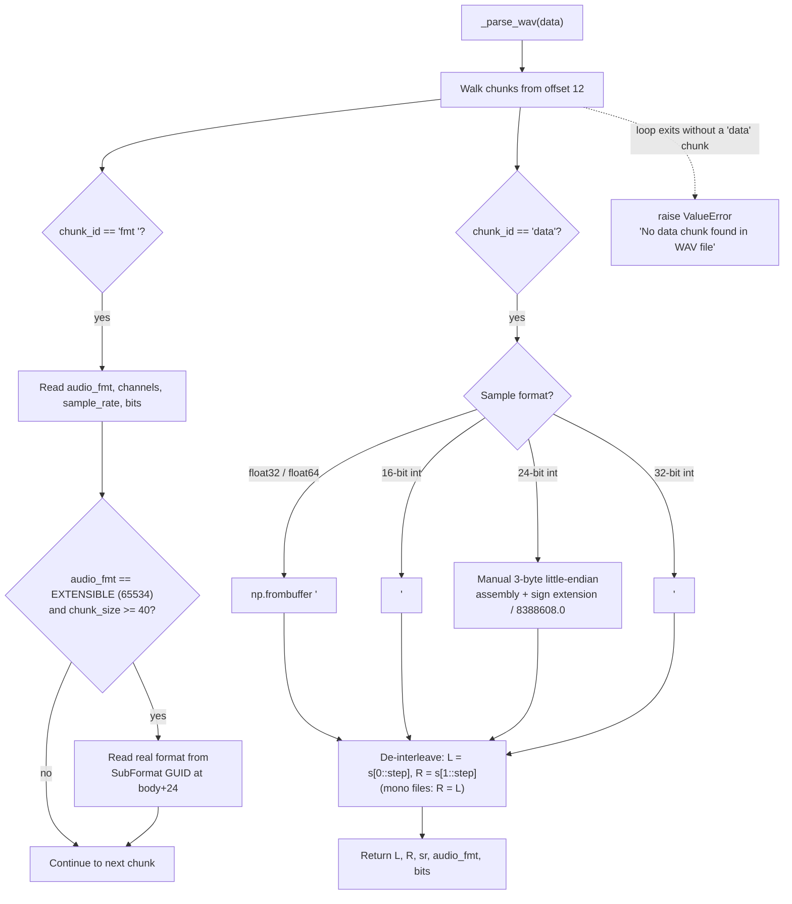
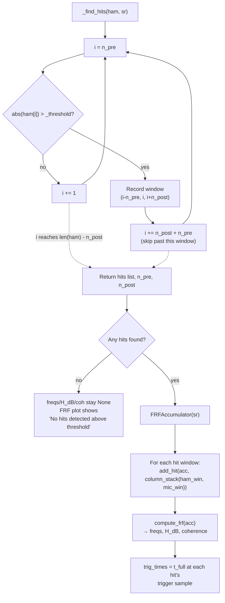

# WAV Viewer — Code Flow

This documents how `wavview.js` (JS/UI, Data Folder scanning, Plotly rendering)
and `main.py` (PyScript — WAV parsing, hit detection, FRF math) work together.
WAV Viewer is an **Experimental**-tier tool: a read-only inspector for stereo
WAV files, with no capture and no writing back to disk.

- JS owns: the Data Folder / File System Access API, recursive folder
  scanning for `.wav` files, the file-list sidebar, the instrument filter,
  and all Plotly rendering.
- Python (`main.py`, backed by `Python/processing/frf.py`) owns: the WAV
  byte-parsing (its own inline chunk parser, not `wavfileio.py`), threshold
  hit detection, envelope downsampling for display, and FRF (H1) + coherence
  math via `FRFAccumulator` / `add_hit` / `compute_frf`.
- The two sides talk through `window.pyWavProcess` / `window.pyWavApplySettings`
  (JS → Python) and `window.onWavLoaded` / `window.onWavError` (Python → JS),
  plus `window.onPyReady` fired once from the bottom of `main.py`.

## 1. Overview — folder to plotted file

## 2. Folder scanning & instrument filter

Selecting a different instrument (`wavFilterInstrument`) just re-runs
`_applyInstrumentFilter()` — it does not rescan disk.

## 3. File selection → Python round trip

`window.onPyReady` (fired once by `main.py` at import time) applies the saved
preferences via `pyWavApplySettings`, then immediately opens any
`_pendingIdx` file that was queued while PyScript was still loading.

## 4. WAV parsing (Python `_parse_wav`)

`main.py` has its own minimal RIFF/WAVE chunk walker (it does not call the
shared `Python/fileio/wavfileio.py`). It walks chunks starting after the
12-byte `RIFF`/size/`WAVE` header until it finds `fmt ` and `data`:

Channel assignment (`process_wav`) then applies `_swap_channels`: by default
`ham = R` (channel 1) and `mic = L` (channel 0), matching Acquire's default
wiring; the Settings modal can flip this per-file-format assumption.

## 5. Hit detection & FRF computation

Both `ham` and `mic` are also passed through `_ds_envelope()` before sending
to JS — a min/max-per-window downsample capped at 4000 windows (8000 output
points) so long WAV files don't choke Plotly or alias into visual noise.
`process_wav` wraps all of this in a `try/except`, calling `onWavError` with
the exception text (truncated to 200 chars) on failure.

## 6. Plotting (JS `onWavLoaded`)

| Plot | Source data | Notable details |
|---|---|---|
| `wav-ham-plot` (Hammer) | `t`/`ham` (downsampled) | Dashed purple threshold lines at ±`p.threshold`; dotted purple vertical lines at each `trig_times` entry |
| `wav-mic-plot` (Microphone) | `t`/`mic` (downsampled) | Same trigger-time vertical markers, no threshold lines |
| `wav-frf-plot` | `freqs`/`Hdb` (purple line) + `coh` (blue line, no legend) | Only drawn when `nHits > 0`; coherence (0–1) is rescaled into the bottom 25% of the current Y range so it overlays without its own axis |
| `wav-frf-plot` (no hits) | — | Single empty trace with a centered annotation naming the threshold, prompting the user to adjust Settings |

Y-axis range: auto-computed from the 99th percentile of `Hdb` (values above
-200 dB only) minus `_S.yDbRange` (default 38 dB), unless the user has
panned/zoomed — `_wireRelayout()` captures `plotly_relayout` events into
`_S.xMin/xMax/yMin/yMax` so the range persists across file switches until
`wavRescaleY()` (↕Y button) resets it to auto again. `wavToggleXLog()`
(X=log/X=lin button) flips `_S.xLog` and redraws the current file.

## 7. Preferences

`wavPreferences()` opens `#prefs-modal`, populated from `_loadPrefs()`
(`localStorage['obieWavView_prefs']`, tool-private — not the shared Data
Folder settings). Fields: trigger `threshold` (V), `pre_trig_s` / `post_trig_s`
window, and `swap_channels` checkbox.

`wavSavePrefs()` — validates/defaults each field, writes to localStorage,
pushes to Python via `pyWavApplySettings(threshold, pre_trig_s, post_trig_s,
swap_channels)` (clamped again on the Python side: threshold ≥ 0.001,
pre ≥ 0.001 s, post ≥ 0.05 s), shows "Saved" in `.save-msg` for 2500 ms, and
if a file is currently open, re-runs `wavSelectFile(_activeIdx)` so the plots
reflect the new settings immediately.

## 8. Other features

| Feature | Function(s) | Notes |
|---|---|---|
| Sidebar resize | `_initResizer()` | Drag handle between `#wav-resizer` and `.wav-sidebar`, width clamped 120–420px; on release, calls `Plotly.Plots.resize()` on all three plots |
| Help / Tips | `wavHelp()`, `wavTips()` | Open `../../Docs/experimental.html` and `../../Docs/shortcuts.html` in new tabs (this tool links to the experimental-tier docs page, not `Docs/index.html`) |
| Filename display | `onWavLoaded` | Strips path down to basename for the status line (`String(fname).split('/').pop().split('\\\\').pop()`), and shows sample rate + `fmtLabel` (e.g. "16-bit int") + hit count |
